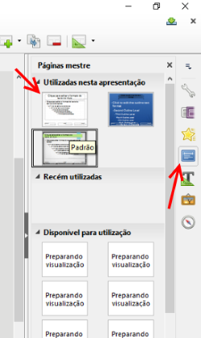
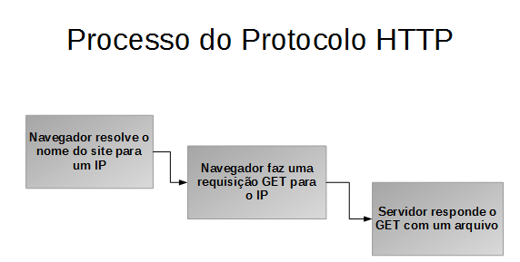
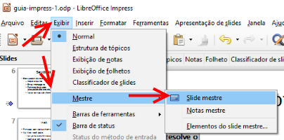
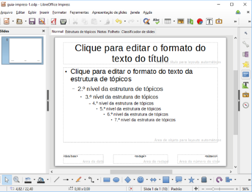
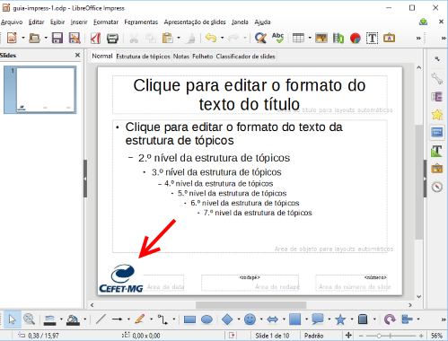
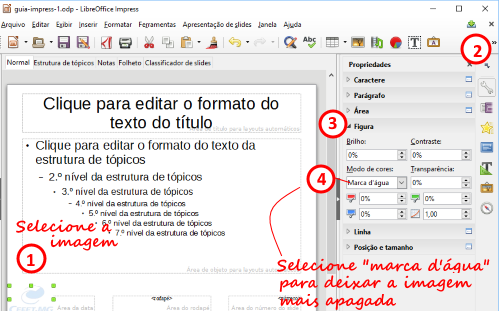
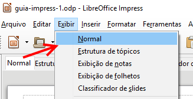

## Guia Apresentações - 2

- Assunto: **Apresentações**: Impress - parte 2
- Objetivos:
  -	Tipos de Apresentação
  - Slide mestre
  - Gráficos, Tabelas e Organogramas

---
## Enunciado

- Na aula de hoje, você vai aprimorar a apresentação do Impress que criou na
  última aula
- Mas, primeiro, vamos relembrar algumas recomendações para a
  criação de apresentações em geral

---
# Orientações de Apresentação de conteúdos

---
## Recomendações (relembrando)

- Preferir **utilizar tópicos**, e não parágrafos grandes
  - O uso de slides cheios de textos dificulta o acompanhamento da pessoa
    que está assistindo a sua apresentação
- Não usar textos com fontes menores que **24pt**
  - Para que mesmo quem está no fundo da sala **consiga enxergar**
- Usar um esquema de cores de **alto contraste**
- **Não "poluir"** os slides com informação demais

---
## Ponto de partida

- Faça _download_ do **seu trabalho da última aula** (`guia-impress-1.odp`).
  Você consegue acessar o arquivo enviado, usando a interface do Moodle
  - Caso não tenha vindo na última aula, peça a apresentação de um colega

---
## 1º passo

- 
  Vamos remover o tema que utilizamos na última aula, já que vamos
  personalizar a apresentação por conta própria

---
## 2º passo

- Crie um novo slide na apresentação na posição 10
  - **Título**: "Processo do Protocolo HTTP"
  - **Conteúdo**: a lista ordenada abaixo
    1. Navegador resolve o nome do site para um IP
    1. Navegador faz uma requisição `GET` para o IP
    1. Servidor responde o `GET` com um arquivo

---
## 3º passo - Diagramas

- Agora, vamos melhorar a aparência das nossas listas de tópicos
- Vamos criar um diagrama com os tópicos do slide 10 para ter uma
  representação mais interessante, visual

  

---
## 3º passo - Diagramas (como criar)

<video controls="true" poster="images/impress-diagrama-1-poster.png" style="height: 400px;">
  <source src="videos/impress-diagrama-1.webm" type="video/webm">
</video>

---
## 3º passo - Diagramas (como estilizar)

<video controls="true" poster="images/impress-diagrama-2-poster.png" style="height: 400px;">
  <source src="videos/impress-diagrama-2.webm" type="video/webm">
</video>

---
## 4º passo

- Escolha **outros 2 slides** que possuam uma lista de tópicos e **substitua
  os textos por diagramas**
  - Estilize os diagramas de formas diferentes

---
## 5º passo - Slide mestre

- Agora, vamos colocar a logomarca do CEFET no canto inferior esquerdo de cada
  slide
  - Uma alternativa é inserir a imagem em cada slide
    - Imagina se, em vez de 10 slides, tivéssemos 100? Demoraria muito...
  - Outra forma, a que vamos utilizar, é por meio do **slide mestre**
- Faça _download_ aqui da logo do CEFET:

  

---
## 5º passo - Slide mestre (cont.)

- O **slide mestre** é como uma "forma de fazer bolo", só que de slides :)
  - O termo correto é **_template_**, que algumas pessoas traduzem para modelo
- 
  Para acessar/alterar o slide mestre acesse a aba "Exibição", seção "Modos
  de Exibição Mestres":

---
## 5º passo - Slide mestre (cont.)

- No modo de slide mestre, o Impress mostra o modelo sendo usado:

---
## 5º passo - Slide mestre (cont.)

- Insira a logomarca do CEFET e posicione-a no canto inferior esquerdo, como
  na imagem

---
## 5º passo - Slide mestre (cont.)

- Vamos agora deixar a logomarca menos visível, de forma que ela não fique
  chamando muita atenção do conteúdo dos slides
  1. 
    Selecione a imagem
  1. Na aba "Formatação", seção "Ajustar", escolha a opção "Cor" e, em seguida,
     a opção cinza claro

---
## 5º passo - Slide mestre (cont.)

- Agora, vamos **sair do modo de slide mestre** e voltar ao modo normal
  - Para isso, no menu "Exibir", clique no botão "Normal"

  

---
## Entrega

1. Salvar como guia-impress-2.odp
1. Entregar **via Moodle** no horário **desta aula**
