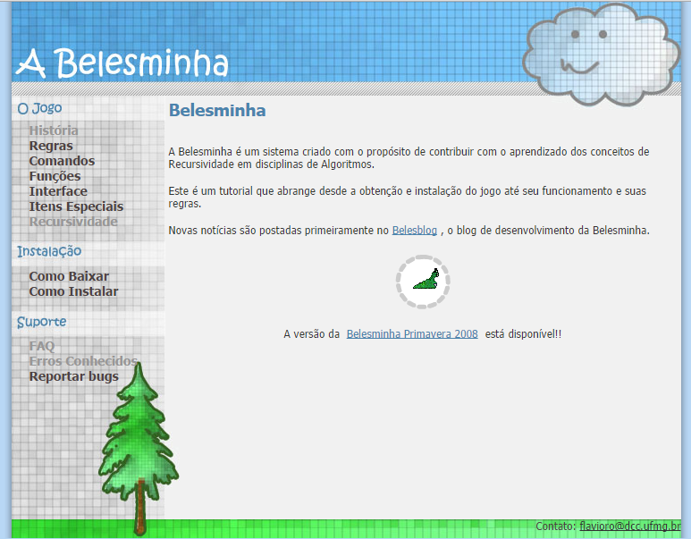

## Guia Interino

- Assunto: **Recursividade**
- Objetivo: Entender o funcionamento da **recursividade** e ganhar uns pontinhos

---
## Roteiro

1. Conheça a [Belesminha](http://homepages.dcc.ufmg.br/~flavioro/belesminha/index.html)
1. Mas o que é recursividade?
1. Missão: salvar a Belesmoca


---
# Conhecendo a **Belesminha**

---


---
## Definição: Belesminha

`s.f.` **1** "A Belesminha é um sistema criado com o propósito de contribuir com o
aprendizado dos conceitos de Recursividade em disciplinas de Algoritmos."

_Fonte: [site da Belesminha](http://homepages.dcc.ufmg.br/~flavioro/belesminha/index.html)_

---
## Objetivo

1. Descrever um algoritmo para _coletar todas as folhas_ e **parar**
1. Não exceder os **limites de comandos e pilha**

---
# O que é **recursividade**?
---
## Recursividade (1/3)

<p class="note" style="width: 80%">
Recursividade ocorre quando **algo é definido em termos dele mesmo**.
</p>
- Em Computação, a forma mais comum de recursividade é quando **uma função
  invoca a si mesma**. Por exemplo, uma função bacana em C:
  ```c
  void dizOlaETravaOPrograminha() {
    printf("Ola ");                 // imprime no terminal
    dizOlaETravaOPrograminha();     // chama a si mesma
  }
  ```

---
## **Exemplo útil** de Recursividade (2/3)

- Na matemática, existe o <u>**fatorial de um número n,**</u> dado por:
  - `n! = n x (n-1) x (n-2) x ... x 2 x 1` para `n` > `1`
  - `n! = 1` para `n=0` ou `n=1`
  - Ou seja,
    - `3! = 3 x 2 x 1`
    - `3! = 6`
  - Outro exemplo,
    - `4! = 4 x 3 x 2 x 1 = 24`
    - Podemos escrever: `4! = 4 x 3!`
      - Se soubermos quanto vale `3!` fica fácil calcular `4!`, certo?
- Como podemos **criar uma função em C/C++ para calcular o fatorial**
  de um número?
  - Há uma forma recursiva: fácil de ler e escrever
  - Há uma forma iterativa (tradicional)

---
## Exemplo de **fatorial com recursividade**

```c
long fatorial(long n) {
  if (n == 0 || n == 1) return 1; // condição de parada: n=1 ou 0
  return n * fatorial(n-1);       // regra básica: n maior que 1
}
```
- Vantagem:
  - fácil de ler e escrever
  - bem **intuitivo**, dada a **descrição matemática**
- Desvantagem:
  - se não houver a **condição de parada**, entra em **_loop_
    infinito** (e trava o programinha!!)
  - pode usar mais espaço da memória RAM para executar

---
## Exemplo de **fatorial iterativo (tradicional)**

```c
long fatorial(long n) {
  long acumulador = 1;
  for (int i = n; i != 1; i--) {
    acumulador = acumulador * i;
  }
  return acumulador;
}
```
- Vantagem
  - gasta menos espaço da RAM
- Desvantagem
  - menos elegante e mais difícil de ler e compreender
  - mais distante da descrição matemática

---
## **Cuidados** com a recursividade

- Cada vez que uma **função é invocada**, ela **ocupa um pequeno espaço**
  na memória RAM, para armazenar:
  - os valores dos seus argumentos (se existirem)
  - os valores das suas variáveis locais (se existirem)
  - outras coisinhas
- Um programa é executado invocando-se sua **função _"main"_**:
  - Essa função é colocada na RAM em um local chamado **pilha de execução**
    - cada nova função invocada é "empilhada" (tipo uma pilha
      de livros) em cima da outra que estava sendo executada
- Se <u>uma função chama a si mesma antes de terminar</u> (_i.e._, ela é
  recursiva), pode-se ocupar mais espaço na RAM do que o disponível
  - Se isso acontece, o programa trava e esse erro se chama **_stack overflow_
    (explosão da pilha)**

---
## Belesminha e recursividade

- Apesar de super elegantes, as funções recursivas podem ser **perigosas se não
  forem programadas devidamente**:
  - Problema de*_loop_ infinito, caso se esqueça da condição de parada
  - Problema de _stack overflow_, caso a função seja executada mais
    vezes do que a RAM comporta
- **A Belesminha** pode coletar suas folhas de forma **recursiva ou iterativa**
  - Cada fase tem:
    - um limite de número de comandos
    - um limite de tamanho (profundidade) da pilha de execução
  - **O tipo de programa** (recursivo ou iterativo) que você deve construir
    **pode variar com os limites de cada fase**

---
## Interface da Belesminha


---
## Comandos ([leia mais](http://homepages.dcc.ufmg.br/~flavioro/belesminha/comandos.htm))


- 
  Comandos:
  - `f`: frente
  - `d`: girar à direita (90º)
  - `e`: girar à esquerda (90º)
- Por exemplo,
  ```
  ffdf
  ```
  - frente, frente, gira para direita, frente

...mas também podemos definir funções com vários comandos -
veja no próximo slide

---
## Funções ([leia mais](http://homepages.dcc.ufmg.br/~flavioro/belesminha/funcoes.htm))

- Simples, sem parâmetro:
  ```bash
  a:fff
  ```
  - Função com nome **`a`**: vai para frente 3x
- Com parâmetro (`P`):
  ```bash
  b(P):fb(P-1)
  ```
  - Função **`b`**: vai para frente 1x e chama-se recursivamente
  - Condição de parada: **pára quando `P == 0`***

\* P==0 é a condição de parada para todas as funções com parâmetros

---
## Atividade

- Jogue o Belesminha até a última fase
- Chegando na última fase, garante-se os pontos da aula
  - Quem passar da última fase, ganha 50% de ponto extra! :3
- Entregue,
  [no Moodle](https://moodle.cefetmg.br/mod/assignment/view.php?id=15651),
  uma _screenshot_ da última fase que você chegou
