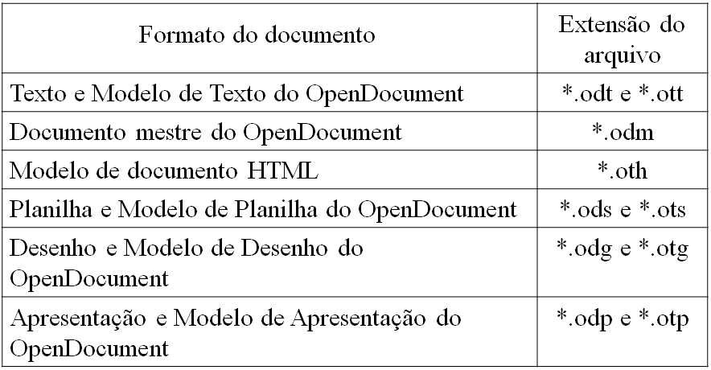
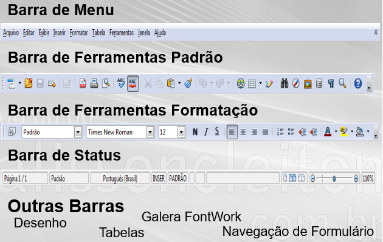
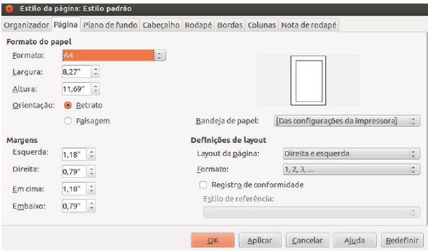
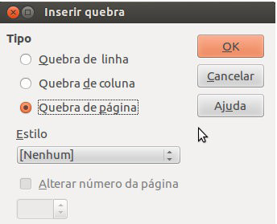
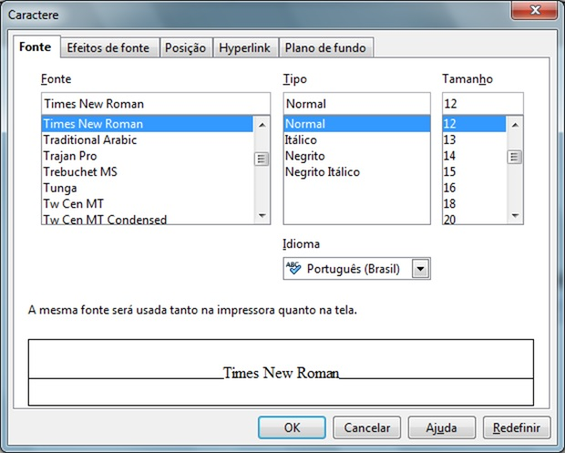
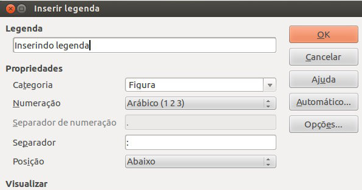
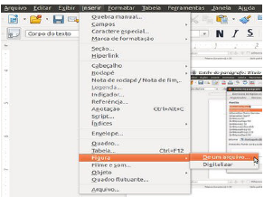
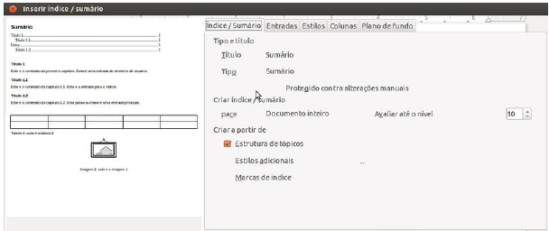

## Guia Processador de Texto - 1

- Assunto: **Processador de texto**: Conhecendo os editores de texto
- Objetivos:
  1. Criar, editar, carregar e salvar documentos
  1. Praticar formatação de texto, uso de estilos, inserção
     de figuras
  1. Usar ferramenta de correção ortográfica

---
## Roteiro
<marquee>ENTREGA DE EXERCÍCIO via Moodle</marquee>

1. Criando e carregando documentos (1 min)
1. Formatação do texto e estilos de _design_ (2 min)
1. Revisão de texto (1 min)
1. **Exercício:** Formatando um texto (60 min)
   

---
# Conhecendo os processadores/editores de texto

---
## O que sao Editores de texto?

- Cada aplicativo (ou programa) foi criado para que o computador realize uma 
  tarefa específica. 
 
- Editores de textos são aplicativos que servem especificamente para escrever 
  e editar qualquer tipo de texto, desde uma carta até um currículo.

- Uma das suas facilidades é a possibilidade de alteração dos documentos criados, 
  inserir e reposicionar parágrafos, substituir palavras, etc
  
- Mesmo após a gravação do documento no computador, é possível modifica-lo. 

---
## Processadores/editores de texto mais usados:

- Word 
  - disponível no pacote Microsoft Office
  - só é executado em sistemas Windows
  - é pago

- Word 
  - disponível no pacote Broffice
  - têm versões para o Linux e Window
  - é gratuito
 
---
## Processadores de texto mais comuns para desktop

---
## Processadores de texto mais comuns para tables e samrtfones

---
## Broffice

Broffice.org é o nome de um conjunto de programas de escritório 
livre (free software), disponível na internet gratuitamente 
(no site www.broffice.org) que oferece ferramentas poderosas para 
o trabalho na maioria das corporações.

## Writer

É um aplicativo do pacote BrOffice.org e sua função é de processar 
texto, oferecendo vários recursos de processamento como: formatação 
de um texto, inserção de objetos (imagens, arquivos e outros...), 
buscando cada vez mais facilitar a criação de documentos.

---
## Vantagens do Writer

 - É gratuito;
 - Salva em formato PDF (Portable Document Format);
 - Compatibilidade com outros programas e arquivos;
 - Melhor númeração de itens;
 - Melhor aproveitamento do recurso “Estilo”.

---
## Tipos de arquivos do writer

---
# Conhecendo o writer

---
## Menu Arquivo

---
## Menu Arquivo: **criar ou abrir documentos**

- Você pode criar um documento em branco através de Novo ou CTRL+N;
   - O comando Novo abre um novo documento do BrOffice. 
     Este documento pode ser,entre outros, um texto, uma planilha, 
     uma apresentação, um arquivo de desenho, ou um banco de dados.
     
- Você pode abrir um documento existente através de Abrir ou CTRL+O;
   - Abre um arquivo. Uma caixa de diálogo será aberta permitindo ao
     usuário navegar pelos mais diversos caminhos.

---
## Menu Arquivo: **usar modelos**

- Você pode usar um **modelo** pronto de algum tipo de document atraves
  do assistente, São exemplos de modelos:
  - Uma lista de presença
  - Um currículo
  - Um certificado
  - Um cartão de visita

---
## Menu Arquivo: Opções **Salvar** e **Salvar como...**

- A primeira vez que se clica em **Salvar** para um documento novo, você deve
  escolher em que pasta e qual o nome do arquivo
- Próximos cliques em **Salvar** não requerem nenhum tipo de escolha
  - O arquivo é salvo com o mesmo nome
- Para criar uma cópia do arquivo atual, use a opção **Salvar Como...** para
  escolher um local e um nome para a cópia
- A opção Recarregar substitui o documento atual pela última versão salva.
- Exportar como PDF permite salvar o conteúdo do documento diretamente em um arquivo PDF,
  implementando, inclusive, a segurança deste tipo de arquivo.

---
## Barras

---
# Formatar Pagina

---
## Formatação de pagina

- Permite selecionar um tamanho de papel predefinido ou digitar suas medidasde largura,
  de altura e de margens. Quando for definir o formato e as margens, se aunidade de
  medida aparecer em polegadas, é necessário que mude para centímetros.
  - Passos: Clique em: Formatar  →  Página → Especificar o formato de papel, altura, largura, 
    orientação, margens → Ok

---
## Formatação de pagina (cont.)

---
# Quebra de Pagina

---
## Quebra de página manual

- Insere uma quebra de página manual e move o texto encontrado à direita do 
  cursor para o início da próxima página.
  - Clique em: Inserir → Quebra manual → Ok

---
## Quebra de página manual (cont.)

---
# Formatação do texto e estilos de _design_

---
## Formatar

---
## Duas formas para formatar texto

- Você pode alterar a fonte, uso de negrito, itálico, sublinhado, tachado,
  tamanho, espaçamento, bordas e várias outras coisas **de duas formas**:
  - (i) Específica:
    - Alteramos a **formatação dos elementos <u>que estão selecionados</u>**
    - Ideal para <u>textos pequenos</u>
  - (ii) Com estilos:
    - Alteramos a **formatação de "partes" da página** como: parágrafos,
      títulos, subtítulos etc.
    - Ideal para <u>textos maiores</u>, mais técnicos ou científicos
- Veja exemplos dos dois nos _slides_ seguintes...

---
## Formatação (i) **específica**

---
## Formatação (ii) **por estilos**

---
## Formatação **por estilos** (cont.)

- Com a formatação por estilos, além de ter a facilidade de alterar várias
  partes do documento de uma vez, também **estamos dizendo ao Writer: isto aqui é
  um título, isto aqui um subtítulo, isto aqui é corpo do texto etc.**
- Dessa forma, conseguimos, por exemplo, gerar um **sumário automaticamente** e
  com o número das páginas preenchido dinamicamente

---
# Revisão de texto

---
## Revisão ortográfica e gramatical

---
# Inserindo legenda

---
## Inserindo legenda

- No LibreOffice Writer, pode-se adicionar legendas em figuras, tabelas, quadros e objetos 
  de desenho, com uma numeração sequencial. Para realizar este comando, siga os passos:
  - Selecione a imagem desejada → Inserir → Legenda
  
---
## Inserindo legenda (cont.)

---
# Inserindo Figura

---
## Inserindo figura

- Para inserir figuras em um documento, realize os seguintes comandos:
  - Clique em: Inserir → Figura → De um arquivo

---
## Inserindo figura (cont.)

---
# Inserindo Índices/Sumários

---
## Inserindo índices/sumários

- É a enumeração dos principais tópicos, estilos de parágrafos, entre outros, que
  constam em um trabalho. Para fazer isto é necessario ter inserido os estilos.
  - Clique em: Inserir → Índices → Índices e Sumários →Faça suas alterações → Ok

- Para atualizar o sumário, basta clicar com o botão direito em cima deste, e depois 
  em atualizar índices/sumários.

---
## Inserindo índices/sumários (cont.)

---
## Curso Básico de LibreOffice

- Curso completo do pacote LibreOffice: 
  https://pt.wikibooks.org/wiki/Curso_b%C3%A1sico_de_LibreOffice

- Acesse o link e tire todas suas duvidas
 
---
## Exercício

  Você deve seguir as informaoces do exercicio no ambiente:
  https://ava.cefetmg.br/mod/assign/view.php?id=3148
  e entrega-lo pelo proprio ambiente.
  
<marquee>ENTREGA DE EXERCÍCIO via AVA/Moodle</marquee>

