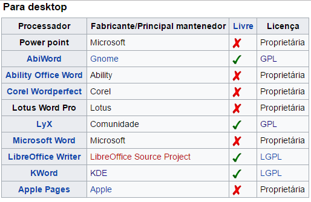
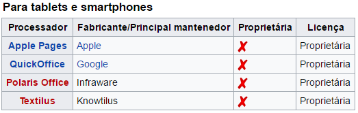
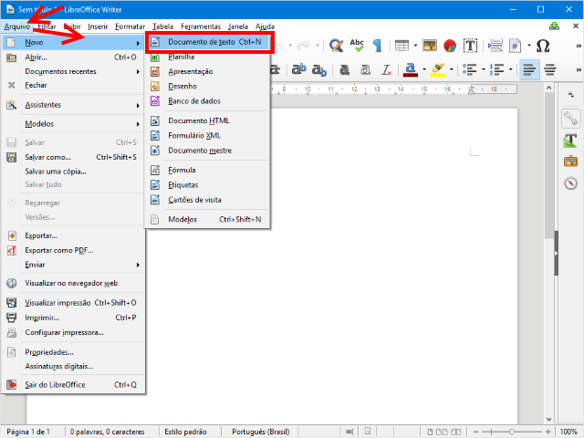
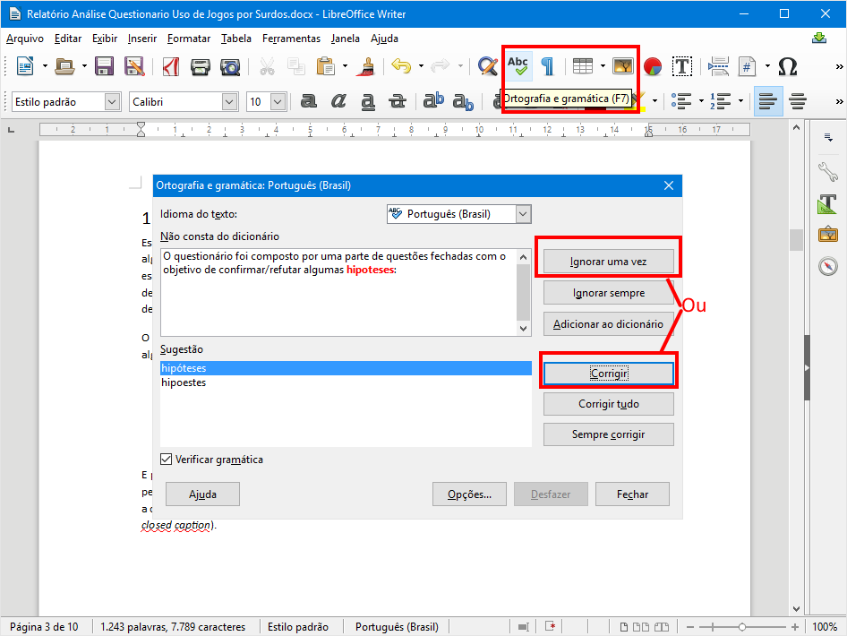

## Guia Processador de Texto - 1

- Assunto: **Processador de texto**: Conhecendo os editores de texto
- Objetivos:
  1. Criar, editar, carregar e salvar documentos
  1. Praticar formatação de texto, uso de estilos, inserção
     de figuras
  1. Usar ferramenta de correção ortográfica

---
## Roteiro
<marquee>ENTREGA DE EXERCÍCIO via Moodle</marquee>

1. Criando e carregando documentos (1 min)
1. Formatação do texto e estilos de _design_ (2 min)
1. Revisão de texto (1 min)
1. **Exercício:** Formatando um texto (60 min)
   

---
# Parte 1: Conhecendo os processadores/editores de texto

---
## O que sao Editores de texto?

- Cada aplicativo (ou programa) foi criado para que o computador realize uma 
  tarefa específica. 
 
- Editores de textos são aplicativos que servem especificamente para escrever 
  e editar qualquer tipo de texto, desde uma carta até um currículo.

- Uma das suas facilidades é a possibilidade de alteração dos documentos criados, 
  inserir e reposicionar parágrafos, substituir palavras, etc
  
- Mesmo após a gravação do documento no computador, é possível modifica-lo. 

---
## Processadores/editores de texto mais usados:

- Word 
  - disponível no pacote Microsoft Office;
  - só é executado em sistemas Windows
  - é pago.
  
 - Writer
   - disponível no pacote Broffice
   - têm versões para o Linux e Window
   - é gratuito

---
## Processadores de texto mais comuns para desktop

---
## Processadores de texto mais comuns para tables e samrtfones

---
## Broffice

Broffice.org é o nome de um conjunto de programas de escritório 
livre (free software), disponível na internet gratuitamente 
(no site www.broffice.org) que oferece ferramentas poderosas para 
o trabalho na maioria das corporações.

## Writer

É um aplicativo do pacote BrOffice.org e sua função é de processar 
texto, oferecendo vários recursos de processamento como: formatação 
de um texto, inserção de objetos (imagens, arquivos e outros...), 
buscando cada vez mais facilitar a criação de documentos.

---
## Vantagens do Writer

 - É gratuito;
 - Salva em formato PDF (Portable Document Format);
 - Compatibilidade com outros programas e arquivos;
 - Melhor númeração de itens;
 - Melhor aproveitamento do recurso “Estilo”.

---

# Parte 2: Criando e carregando documentos

---
## Menu Arquivo

---
## Menu Arquivo &gt; Opção **Novo** (cont.)

- Você pode criar um documento em branco
- Mas também pode usar um **modelo** pronto de algum tipo de documento, por
  exemplo:
  - Uma lista de presença
  - Um currículo
  - Um certificado
  - Um cartão de visita

---
## Menu Arquivo &gt; Opções **Salvar** e **Salvar como...**

- A primeira vez que se clica em **Salvar** para um documento novo, você deve
  escolher em que pasta e qual o nome do arquivo
- Próximos cliques em **Salvar** não requerem nenhum tipo de escolha
  - O arquivo é salvo com o mesmo nome
- Para criar uma cópia do arquivo atual, use a opção **Salvar Como...** para
  escolher um local e um nome para a cópia

---
## Menu Arquivo &gt; Opção **Abrir**

- Para carregar um arquivo, você pode acessar a opção **Abrir** e selecionar o
  documento do sistema de arquivos (pasta e nome do arquivo)

---
# Parte 3: Formatação do texto e estilos de _design_

---
## Duas formas para formatar texto

- Você pode alterar a fonte, uso de negrito, itálico, sublinhado, tachado,
  tamanho, espaçamento, bordas e várias outras coisas **de duas formas**:
  - (i) Específica:
    - Alteramos a **formatação dos elementos <u>que estão selecionados</u>**
    - Ideal para <u>textos pequenos</u>
  - (ii) Com estilos:
    - Alteramos a **formatação de "partes" da página** como: parágrafos,
      títulos, subtítulos etc.
    - Ideal para <u>textos maiores</u>, mais técnicos ou científicos
- Veja exemplos dos dois nos _slides_ seguintes...

---
## Formatação (i) **específica**

---
## Formatação (ii) **por estilos**

---
## Formatação **por estilos** (cont.)

- Com a formatação por estilos, além de ter a facilidade de alterar várias
  partes do documento de uma vez, também **estamos dizendo ao Writer: isto aqui é
  um título, isto aqui um subtítulo, isto aqui é corpo do texto etc.**
- Dessa forma, conseguimos, por exemplo, gerar um **sumário automaticamente** e
  com o número das páginas preenchido dinamicamente

---
# Parte 4:  Criando um sumário

---
## Sumário (1/2)

- Uma vez que você marcou quais são seus títulos e subtítulos, você pode gerar
  o sumário automaticamente

  

---
## Sumário (2/2)

---
# Parte 5: Revisão de texto

---
## Revisão ortográfica e gramatical

---
# Parte 6: Um Relatório Técnico (Exercício)

- Entrega **até o final desta aula** via Moodle
- Você deve entregar o seu documento em formato .docx

 <marquee>ENTREGA DE EXERCÍCIO via Moodle</marquee>

---
## Exercício

  Você deve criar um texto científico com o conteúdo e formatação idênticos a
  [este relatório técnico][rel]. A imagem a ser utilizada
  é [esta aqui](images/word-grafico.png).

[rel]: attachments/relatorio.zip

---
## Exercício (cont.)

1. O documento deve usar a fonte Calibri (corpo) tamanho 10, com parágrafos
   justificados
1. Algumas listas possuem mais de uma coluna
1. Palavras em negrito, itálico, etc. devem ser idênticas às do documento de
   referência
1. A capa deve ser semelhante à do documento de referência, mas não precisa ser
   idêntica. Ela deve conter seu nome completos
1. As páginas devem conter numeração no seu rodapé, do lado direito

---
## Exercício (cont.)

1. O **sumário** deve ser criado **automaticamente**
   - Portanto, utilize os **estilos de títulos** para criar os títulos das seções
1. Você deve incluir a figura do gráfico referenciá-la com uma **referência
   cruzada**
1. A tabela deve possuir uma legenda (Tabela 1: Tabela com as sugestões...) e
   ela deve ser referenciada por uma **referência cruzada** também
   - Use **estilos de _Design_** para colorir a tabela
   1. O documento de referência possui erros de escrita (ortografia e gramática).
      Você deve **encontrar e corrigir todos os erros**

