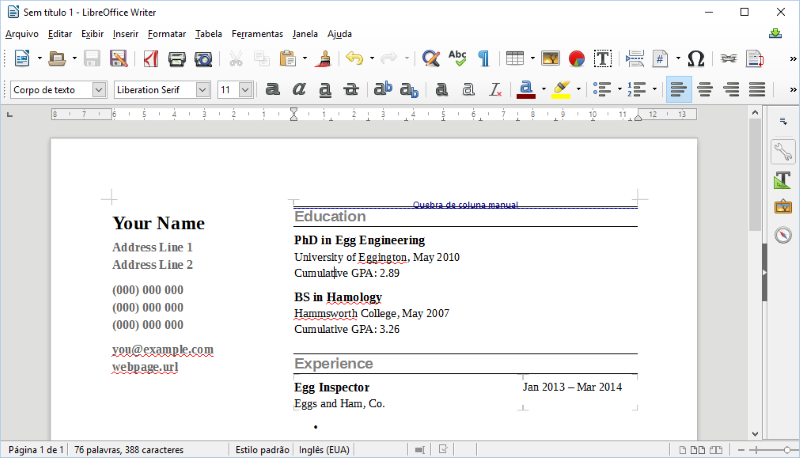
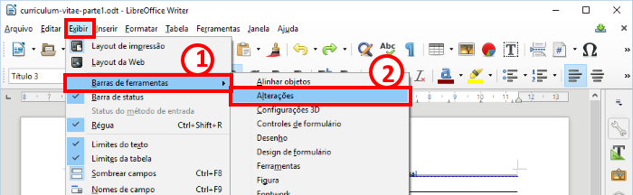
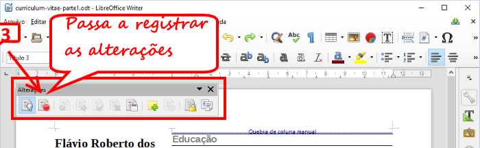
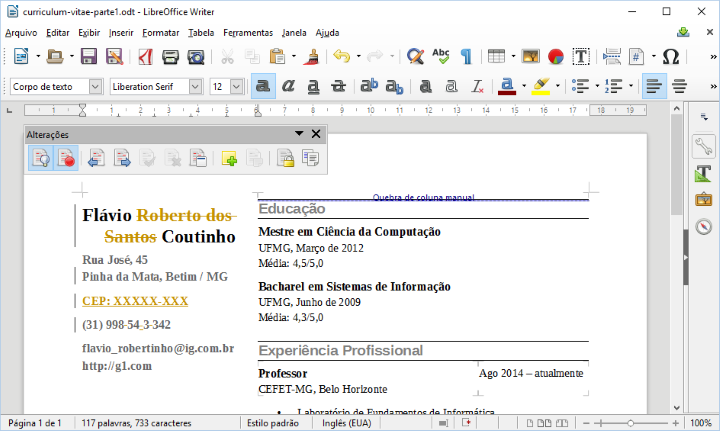
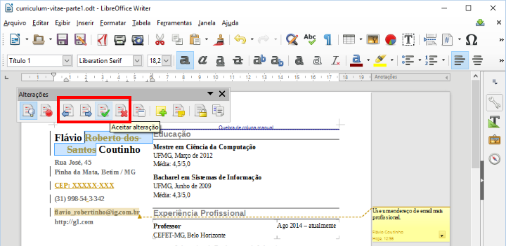

## Guia Editores de Texto - 3

- Assunto: **Processador de texto**: Contruindo um Currículo
- Objetivos:
  1. Usar modelos de documento
  1. Praticar formatação de texto, criação de tabela, uso de estilos, inserção
     de figuras, referências e índices
  1. Conhecer e praticar o uso das ferramentas de revisão

---
## Roteiro - Exercício

1. Criar seu currículo (35 min)
1. Enviar seu currículo para o colega ao lado e receber o dele (2 min)
1. Fazer alterações para melhorar o currículo do colega (10 min)
1. Receber seu currículo com altlerações (2 min)
1. Aplicar ou rejeitar as alterações (10 min)

<!-- link para baixar templates: http://templates.libreoffice.org/template-center -->
---
# Entrega: via Moodle até o final **desta aula**

- Entregar, em um arquivo compactado (.zip, .rar, .7z):
  1. Seu currículo inicial (`curriculum-vitae-parte1.odt`, da Parte 1)
  1. O currículo do seu colega revisado (`curriculum-vitae-colega-parte3.odt`, da Parte 3)
  1. O seu currículo após as alterações (`curriculum-vitae-parte5.odt`, da Parte 5)

- Atenção: como você deve enviar 2 versões diferentes do seu documento (+1 do
  seu colega), você vai <u>precisar criar arquivos diferentes</u>
  (**"Salvar Como"**)

---
# Parte 1
## **Criar** o currículo

- Você deve criar um novo documento no Writer e usar um **modelo de currículo**
  - veja como fazer isso nos <u>próximos slides</u>
- **Preencher o currículo** com suas informações - pessoais, acadêmicas,
  profissionais
  - Além disso, **traduza** os campos do currículo
- Você **pode** fazer alterações no formato se quiser ter um currículo com uma
  aparência diferente do modelo padrão
- Salvar seu currículo: `curriculum-vitae-parte1.odt`

---
##  Documento a partir de um modelo

<figure class="bulleted-image" style="width: 800px; height: 458px;">
  
  
  
  
</figure>

---
# Parte 2
## **Enviar seu currículo** para o colega ao lado e **receber** o dele

- Enviar seu currículo por e-mail
- Receber o do colega

---
# Parte 3
## **Revisar e criticar** o currículo do colega

---
## Ferramentas de revisão

- O Writer tem ferramentas para facilitar a **revisão por pares**
  (_peer review_) de documentos
  - Muito útil para casos em que uma pessoa é "dona" e responsável por um
    documento, mas ela quer aceitar sugestões de outra(s) pessoa(s)
    - Exemplo: aluno escrevendo sua monografia e tendo ajuda do professor
      orientador
- As ferramentas de **"Alterações"** dão acesso a esse recurso do Writer

<figure class="bulleted-image" style="width: 700px; height: 216px;">
  
  
</figure>

---
## Ferramentas de revisão (cont.)

- Para usar
  - Você deve ativar o **controle de alterações**

  

---
## Ferramentas de revisão (cont.)

- **Toda alteração** que você fizer no documento ficará **marcada**. Por
  exemplo:

  

---
## Ferramentas de revisão (cont.)

- Você também pode escrever **comentários** sobre trechos do texto, com
  sugestões de alteração mais complexas ou com explicações sobre suas alterações

  

---
## Ferramentas de revisão (cont.)

- Finda sua revisão, você deve **<u>desativar</u> o controle de alterações**
- Salvar o currículo do colega: `curriculum-vitae-colega-parte3.odt`

---
# Parte 4
## Enviar o currículo revisado do colega de volta para ele

- Enviar por e-mail ao colega

---
# Parte 5
## Receber seu currículo revisado e **aplicar/recusar as sugestões**

---
## Aplicando/rejeitando alterações

- Você deve aceitar ou rejeitar todas as alterações realizadas por seu colega
  no seu currículo. Além disso, você também deve ler e remover eventuais
  comentários que ele tenha realizado e optar por fazer mais modificações

  

---
## Aplicando/rejeitando alterações (cont.)

- Após lidar com as alterações
  - Salvar seu currículo: `curriculum-vitae-parte5.odt`
  - Poste-o no moodle anexando-o a esta lição.
