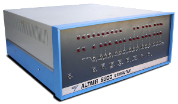
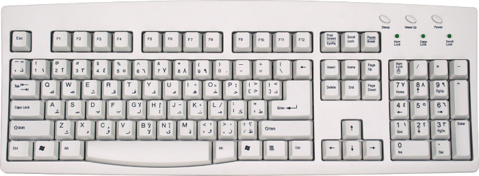
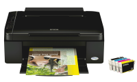
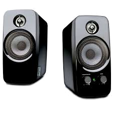

## Guia Hardware: E/S

- Assunto: Dispositivos de entrada e saída (E/S)
- Objetivo:
  1. Conhecer os periféricos de entrada e saída

---
# Arquitetura de um computador

- As peças que compõem um computador podem ser divididas em 3 grupos:
  1. Dispositivos de **entrada**
  1. Dispositivos de **processamento**
  1. Dispositivos de **saída**

---
# Dispositivos de **entrada** e **saída**

- O que tornava o Altair 8800  pouco prático e útil?
  1. Primeiramente, não havia uma linguagem de programação
  1. Mesmo depois de ter o Basic, seus dispositivos de **entrada e saída eram muito ruins**
    - Entrada de dados: os interruptores
    - Saída de dados: as luzes vermelhas

---
# Dispositivos **de entrada**

---
## Entrada: Teclado

- Explicação sobre [os grupos de teclas](http://www.gcflearnfree.org/computerbasics/5.3)
  - [Versão traduzida](http://www.microsofttranslator.com/bv.aspx?from=&to=pt&a=http%3A%2F%2Fwww.gcflearnfree.org%2Fcomputerbasics%2F5.3)  pelo _Bing Translator_

---
## _Layout_ do teclado

- O _layout_ de um teclado define a disposição das teclas em um teclado
  - Já se perguntou por que as letras não estão em ordem alfabética?
  - O _layout_ que estamos acostumados chama-se **QWERTY** (por causa das letras no canto esquerdo superior)
  - Mas existem outros _layouts_ também: **AZERTY** e **Dvorak**, entre outros
- O que pode/deve ser considerado ao se definir a disposição das teclas?
  - **Ergonomia** (interação saudável, confortável e eficiente)
  - Frequência de uso das teclas

---
## Estudos sobre _layouts_ de teclado

- Existem pesquisas de comparação dos [_layouts_ mais adequados](http://patorjk.com/keyboard-layout-analyzer/#/main).
  Clique no link e digite um texto para ver se teria sido mais confortável digitá-lo usando outro _layout_

---
## Outros alfabetos

- Além disso, teclados em países cujas línguas usam outros alfabetos possuem _layouts_ ainda mais diferentes
  - Teclado árabe:

    

---
## Dispositivos **apontadores**

- Servem para posicionar o ponteiro na tela. Tipos:
  1. 
    _Mouse_
  1. _Touchpad_
  1. Tela sensível a toque (_touch screen_)

---
## Mais dispositivos **apontadores**

1. Joystick
  - Normalmente usado em jogos e simuladores
1. Mesa + caneta gráfica
  - Indispensável para _designers_ e ilustradores
1. Bastão apontador (_pointing stick_)
  - Costumava ser usado em _notebooks_

---
## Outras formas de **entrada de dados**

- O **_Scanner_** ótico usa um feixe luminoso para digitalizar dados e convertê-los em sinais elétricos, que são
  enviados ao computador para serem processados. Com os dados, pode-se querer gerar uma imagem (`.png`, `.jpg`  etc.)
  ou mesmo gerar texto que possa ser editado.
  - No caso da geração de texto, o computador precisa tentar entender o que está escrito, **transformando uma imagem
    cheia de caracteres em um conjunto de letras, números e símbolos**. O nome dessa técnica é _Optical
    Character Recognition_ (OCR)

---
## Como fazer OCR?

- Várias tipos de algoritmos podem ser usados:
  1. Redes neurais
  1. Reconhecimento de padrões
  1. Extração de características e classificação
- Coisas legais que estudamos em **cursos superiores de Computação** ;)

---
## Outras formas de **entrada de dados**

- **Câmeras digitais**
  - Registram imagens (ou sequências de imagens - denominadas "vídeo") que são uma grade de **pixels** - cada pontinho
    da imagem que possui uma cor
  - A largura, multiplicada pela altura dessa grade é o número que chamamos de **resolução**
    - Exemplo de resolução: 1,3 megapixels (equivalente a algo como 1280 x 1024)
- Algoritmos de OCR podem ser usados em imagens captadas por câmeras também

---
## Além do OCR

- Além do reconhecimento de caracteres (OCR), existe também:
  1. _Optical Mark Recognition_ (OMR) ou reconhecimento de marcas
    - 
      Usado para detectar, por exemplo, **o preenchimento de respostas** em um gabarito de prova
  1. Reconhecimento de caracteres manuscritos
    - Em vez de caracteres "digitados", é possível, porém bem mais difícil, reconhecer textos escritos "à mão"
  1. Leitura de códigos de barras
    - 
      O código de barras representa um número normalmente usado como um **código universal de produto** -
      que identifica um produto em uma loja, por exemplo

---
# Dispositivos **de saída**

---
## Monitor

- Dispositivo de saída mais comum
- Mostra o contexto de execução corrente do computador e as opções disponíveis
- O tamanho da tela é medido de acordo com sua diagonal
  - Exemplo: um monitor de 15" (polegadas) possui uma diagonal de 15" (38,1cm)
- A tela é dividida em uma **grade de pixels** e a **resolução** máxima é dada pela multiplicação do
  número de pixels na **largura x altura**
  - Por exemplo, 1440 x 900
- Tecnologias mais comuns para a criação de monitores:
  1. _Cathode Ray Tube_ (CRT) ou tubo de raio catódico
  1. _Liquid Crystal Display_ (LCD) ou tela de cristal líquido
  1. Plasma

---
## Monitor

- Já se perguntou se tem como uma **pessoa que não exerga** usar o computador?

<iframe width="480" height="360" src="https://www.youtube.com/embed/JbDO6H9tiWw?rel=0" frameborder="0" allowfullscreen></iframe>

---
## Monitores **CRT**

- Aproveitou-se a tecnologia usada para criar as **televisões**
- 
  [Assista um vídeo](https://www.youtube.com/watch?v=Gnl1vuwjHto)
  (em inglês) sobre como funciona um monitor (ou tv) com a tecnologia CRT
- É necessário que ele:
  - **seja grande**, para acomodar o canhão de energia (cátodo)
  - **tenha a tela curva**, para que a energia percorra sempre a mesma
    distância até a tela

---
## Outros monitores

- _Liquid Cristal Display_ (LCD)
  - Cada pixel são três (rgb) "orifícios" que permitem passagem de luz branca
  - Demonstração:
    [Desmontando um monitor de LCD (Enginner Guy)](https://www.youtube.com/watch?v=jiejNAUwcQ8)
- Plasma
  - Composto por um grande número de lâmpadas de neon
  - Cada pixel tem uma célula de fósforo que é incandecida por raios
    violeta emitidos pelo plasma

---
## Impressora

- Um dispositivo para geração de imagens em papel
- Tipos mais comuns:
  1. Impressão a janto de tinta
  1. Impressão a laser
  1. Impressoras tridimensionais

---
## Funcionamento da impressora **a jato de tinta**

- Elas **borrifam pontos de tinta** no papel
- Podem imprimir em escala de cinza (usando apenas tinta preta) ou colorido
  - Para colorir, a impressora mistura as cores primárias (amarelo, azul, vermelho) para formar
    diversas outras cores  
- Assista um vídeo sobre como as [impressoras a jato de tinta funcionam](https://youtu.be/xfwXvOgSKys?t=48s)

---
## Funcionamento da impressora **a laser**

1. Vários feixes de laser "marcam" um cilindro condutor de luz com a imagem a ser impressa
  - Isso faz com que a parte que deve ser "desenhada" fique com **carga elétrica neutra**
1. O **toner** (tinta), com **carga elétrica negativa**, gruda no cilindro condutor apenas onde havia carga neutra
1. O papel, ao entrar na impressora, recebe **cargas positivas**
1. Ao passar pelo cilindro (com a tinta do toner nos lugares certos), o papel **(+)** atrai a tinta que
  estava no cilindro **(-)**, mas a tinta ainda está fresca
1. Ao sair da impressora, o papel é aquecido a ~200°C para que a tinta fique permanentemente fixada
  - Veja um vídeo (em inglês) [sobre a impressora a laser](https://youtu.be/yMmupCmo-70)

---
## Impressora 3D

<iframe width="640" height="360" src="https://www.youtube.com/embed/u2xIn3OrAEg?rel=0&t=11s" frameborder="0" allowfullscreen></iframe>

- Materiais
  1. Resina de plástico
  1. Metal
  1. Açúcar
  1. [Cimento??](https://www.youtube.com/watch?v=SObzNdyRTBs)

---
## Alto-falantes

- As caixas de som (ou alto-falantes) e suas variações (e.g., fone de ouvido) são usadas para saída
  de som

---
## Saída **háptica**

- Telefones celulares e _joysticks_ de _video games_ costumam ter um **dispositivo de vibração**,
  que normalmente são usados para dar o retorno de que algo aconteceu (ou dar _feedback_)
  - Exemplos: uma tecla foi pressionada no celular, houve uma explosão em um jogo etc.
  - Eles também são dispositivos de saída, que estimulam nosso sentido tátil
- Como fazer um objeto vibrar "sozinho"?
  - Um **motor de vibração** faz com que um peso assimétrico movimente o centro de gravidade do dispositivo
  - Vídeo mostrando [o motor de vibração de um telefone celular](https://www.youtube.com/watch?v=WWgN20Xx-5A)

---
# Exercícios

---
## Exercícios

- Vá ao **Moodle** e faça os exercícios relativos aos dispositivos de entrada e saída
- Tempo limite: até o final desta aula

---
# Na próxima aula...

<iframe frameborder="0" width="100%" height="400"
  src="https://studio.verold.com/projects/55626e1ef2ff7ce015211072/embed">
</iframe>
