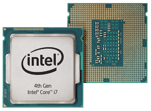
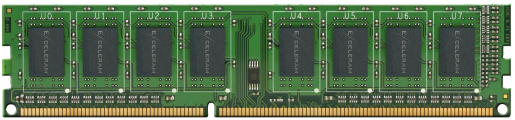
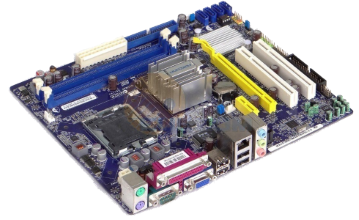

## Guia Hardware: **CPU  e Memória Principal**

- Assunto: CPU e memória principal
- Objetivo:
  1. Entender que partes são essenciais para um computador
  1. Conhecer o funcionamento do processador
  1. Conhecer a hierarquia de memória

---
# Arquitetura de um computador


- As peças que compõem um computador podem ser divididas em 3 grupos:
  1. Dispositivos de **entrada**
  1. Dispositivos de **processamento**
  1. Dispositivos de **saída**

---
# Unidade Central de Processamento (CPU)



---
## A CPU (ou o processador)

- É um conjunto complexo de circuitos eletrônicos que executam instruções de programas
- Consiste em duas partes:
  1. Unidade de controle
  1. Unidade lógica e aritmética (_arithmetic/logic unit_ ou ALU)
- O computador possui armazenamento (ou memória) primário (RAM, ROM, Cache) e secundário (HD, Flash, DVD-ROM etc.)
  - A CPU tem uma relação muito próxima com o armazenamento primário
- Para entender o que signfica **instruções de programas**, vamos pegar um pequeno desvio...

---
<!--
backdrop: detour
-->

## **Executando** um programa

- Quando executamos um programa (um arquivo `.exe`), os seguintes passos acontecem:
  1. Seu conteúdo contendo instruções de execução (em formato de **código de máquina**)
    é transportado do disco rígido (HD) **para a memória RAM**
  2. **O processador** começa a solicitar da memória RAM cada instrução do programa e as **executa**
  3. Os resultados são **salvos na memória RAM** e exibidos na tela
- Mas o que é esse **código de máquina**?

---
<!--
backdrop: detour
-->

## **Compilando** um programa

- **Código de máquina** é um formato binário de **instruções** que o processador sabe executar
  - Podemos dizer que é a linguagem de programação que o processador sabe executar
  - Mas como geramos esse código de máquina?
- Quando compilamos um programa em C/C++, o compilador:
  1. Transforma de **C/C++** para uma **linguagem intermediária chamada Assembly**
  1. Traduz de Assembly para o formato binário, **em código de máquina**
- Podemos **ver o compilador** fazendo isso!

---
<!--
backdrop: detour
-->

## Processo de compilação


---
<!--
backdrop: detour
-->

## Como posso eu mesmo fazer isso?

- Para instruir o compilador para gerar código **assembly**:
  ```bash
  $ g++ -S meuArquivo.cpp
  ```
  - Um arquivo com nome `meuArquivo.s` será gerado, contendo instruções em assembly
- Para compilar normalmente (e gerar código de máquina):
  ```bash
  $ g++ meuArquivo.cpp
  ```
- Para visualizar o código de máquina (arquivo `.o` ou `.exe`)
  ```bash
  $ objdump -d meuArquivo.exe
  ```

---
<!--
backdrop: detour
-->

## O que é uma instrução?

- Como mencionamos, o **processador executa instruções dos programas** que
  eventualmente são carregados na memória
- Cada linha do arquivo **assembly** possui uma instrução
  - Exemplos de instruções:
    - Atribui um valor de um "lugar" a outro
    ```x86asm
    movl orig, dest     ;; dest recebe orig
    ```
    - Soma dois valores e coloca o resultado na direita
    ```x86asm
    addl orig, dest     ;; dest recebe orig+dest
    ```
- Vocês terão muitas oportunidades para brincar com **assembly** =)
  - Veja [algumas instruções][x86_64] dos processadores Intel/AMD

[x86_64]: https://cs.brown.edu/courses/cs033/docs/guides/x64_cheatsheet.pdf

---
## De volta ao processador: as duas unidades

- A **unidade de controle**:
  - Usa sinais elétricos para coordenar a execução de instruções pelo processador
  - Comunica-se com a unidade lógica e aritmética e com a memória
- A **unidade lógica e aritmética** (ou ALU):
  - Executa operações com números binários, sejam elas lógicas (AND, OR, NOT etc.)
    ou aritméticas (soma, multiplicação etc.)
  - Além dessas operações, a ALU pode realizar comparações
    - Isto é essencial para que seja possível **tomar decisões diferentes dependendo
      de certas condições**
- Além delas, o processador possui **registradores** (próx. slide)

---
## **Registradores**

- Áreas de armazenamento temporário **dentro do processador** com altíssima velocidade de acesso
- Dentro do processador, servem para **armazenar os operandos e resultados das instruções**
- Analogia com a caixa registradora de lojas:
  _"Um lugar conveniente, temporário, para armazenar o que é usado nas transações"_
- Há dois tipos:
  1. Registradores **de propósito geral**, usados para guardar operandos comuns
  1. Registradores **especiais**, com funções específicas, por exemplo:
    - Manter a instrução atualmente sendo executada
    - Controlar onde a próxima instrução será armazenada
- Um processador possui aprox. **16 registradores de propósito geral**  

---
## Instruções e registradores

- Os registradores podem ser identificados por nomes. Em processadores de 64 bits da Intel/AMD, os nomes são:
  ```
  rax, rbx, rcx, rdx, rbp, rsp, rsi, rdi,
  r8, r9, r10, r11, r12, r13, r14, r15
  ```
- Uma instrução normalmente referencia registradores de origem e destino. Por exemplo:
  ```x86asm
  movl %rsp, %rbp     ;; O conteúdo do registrador %rbp
                      ;; recebe o valor que está no %rsp
  ```


---
# Memória

---
## Tipos de memória

- Os registradores também armazenam dados, então são considerados parte da memória do computador
- Além deles, existe outro tipo de memória dentro do processador chamada _cache_
  - Sua velocidade está entre a velocidade dos registradores e da RAM
- O papel de cada nível de memória:
  1. **Registradores** armazenam os dados da **operação sendo executada**
  1. **RAM** armazena o código e as variáveis do **programa sendo executado**
  1. **HD** armazena o código dos programas que podem a vir serem **executados no futuro**

---
## Hierarquia de memória

- 
  Por que há vários tipos de memória?
  - Se fosse tecnicamente e economicamente viável, teríamos apenas uma memória, super rápida, super grande
  - Mas memórias rápidas são muito caras
  - E precisamos de memórias grandes para armazenar grandes volumes de dados

---
## RAM (_Random Access Memory_)



- A RAM (ou memória de acesso aleatório) é um tipo de armazenamento **volátil**:
  <abbr title="id est (isto é)">_i.e._</abbr>, ela perde os dados na ausência
  de energia elétrica
  - Assim como registradores e _cache_
- Ela **armazena as instruções e os dados dos programas** (as variáveis) que estão sendo executados

---
# Como a CPU executa instruções

---
## Preparação para execução de instruções

- Assim que executamos um programa, seu código (instruções), que está em memória
  secundária (<abbr title="exempli gratia (por exemplo)">_e.g._</abbr>, no HD),
  é trazido para a memória primária (<abbr title="exempli gratia (por exemplo)">_e.g._</abbr>, para a RAM)
- Lembre-se que uma instrução é algo como:
  ```x86asm
  addl orig, dest
  ```
  - Que soma o número contido no registrador `orig` ao número em `dest` e coloca
    o resultado da soma no registrador `dest`

---
## Ciclo do processador

- Então, para cada instrução, o processador faz 4 etapas:
  1. A unidade de controle obtém a instrução
  1. A unidade de controle decodifica a instrução e busca os operandos na memória
  1. A unidade de controle transfere os dados para registradores e a ALU executa a instrução
  1. A unidade de controle armazena o resultado da operação da ALU em um registrador ou na RAM
- Veja a imagem no próximo slide

---
## Ciclo do processador (cont.)


---
## Ciclo do processador e o **_clock_ do sistema**

- O processador possui o _clock_ do sistema que produz um **pulso elétrico a uma taxa fixa
  para sincronizar todas as operações do computador**
  - O _clock_ do sistema não tem a ver com o relógio
- O _clock_, medido em **ciclos por segundo** (Hz), determina a velocidade com que o processador consegue executar
  as 4 fases de uma instrução
  - O processador de um computador pessoal hoje em dia trabalha em aprox. 2,4GHz (Giga Hertz, ou 1 bilhão de ciclos por segundo)
- Se a RAM está fora do processador, como eles se comunicam?

---
# A placa mãe

---
## Placa mãe



- É uma placa de circuitos com um conjunto de chips e conexões que **organizam as atividades do computador**
- **Todos os componentes e dispositivos** do computador se **conectam** a ela
  - Processador, memória, disco rígido, drive de DVD, fonte, dispositivos de entrada e saída etc.
