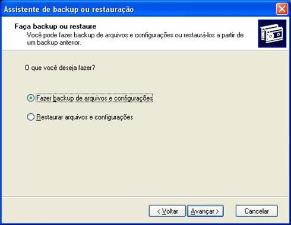
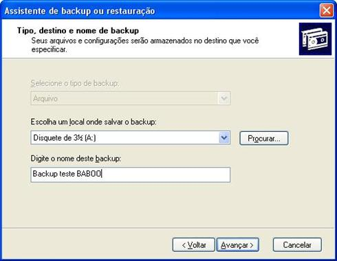
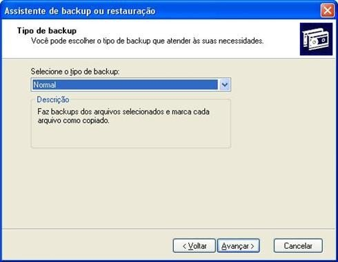

## Guia 18

- Assunto: **Backup** (Cópia de Segurança) e **Criptografia**
- Objetivos:
  1. Entender o processo de _backup_
  1. Conhecer as etapas e os tipos diferentes de _backup_
  1. Praticar a criação de _backups_ no Windows
  1. Entender e praticar o conceito de cópia criptografada de dados

---
## Roteiro

1. _Backup_
   <marquee>ENTREGA DE EXERCÍCIO via Moodle</marquee>
1. Criptografia
   <marquee>ENTREGA DE EXERCÍCIO via Moodle</marquee>

---
# Parte 1: _Backup_

---

---
## Definição de _Backup_

- Do inglês, "cópia de segurança"
- Pode se referir a:
  1. Uma cópia de arquivos que foi realizada no passado
  1. O processo de criação de cópias (de segurança) de arquivos
- Propósitos
  - **Primário: recuperar dados que foram perdidos por exclusão ou corrupção**
    - Exemplos: ataque, exclusão acidental, dano no disco rígido etc.
  - **Secundário: recuperar dados de um momento anterior**
    - Exemplos: desfazer-se das últimas alterações, manter histórico de
      modificações

---
## Características

- A cópia dos arquivos pode ocupar muito espaço
- Em vez de fazer uma cópia simples, os arquivos são
  1. **Comprimidos**, para ocupar menos espaço
  1. **Deduplicados**, para evitar cópias idênticas do mesmo conteúdo
  1. **Criptografados**, para proteger os dados contra acesso ilegítimo

---
## Tipos de Mídia

- Pode-se armazenar os arquivos de _backup_ em diversos tipos de mídia. Alguns
  exemplos:
  - Fita magnética (ainda é bem comum em _mainframes_)
  - Disco rígico
  - Disco óptico
  - SSD
  - Remoto (_e.g._, na nuvem)
  - Disquete (alguém usa isso? :)

---
## Estratégias de criação de _backups_

1. Não estruturada
  - Exemplo: cópias realizadas sem rotina
1. Imagem completa
  - Exemplo: deep freeze
1. Incremental ou Diferencial
  - Uma cópia completa, seguida de pequenas cópias apenas do que foi alterado
1. Proteção contínua
  - O sistema armazena uma lista de alterações no momento que elas são realizadas

---
## Exercício 1

### Ferramenta de _backup_ do **Windows XP** (ou para [Windows 7](http://www.howtogeek.com/howto/1838/using-backup-and-restore-in-windows-7/))

- Faça download dos [arquivos de exemplo](https://raw.githubusercontent.com/fegemo/cefet-lfui/master/src/MeusArquivos.zip)
- Descompacte-os **em sua Área de Trabalho** em uma pasta chamada "Meus Arquivos"
- Você deve criar um _backup_ da pasta "Meus Arquivos" usando o utilitário de
  _backups_ do Windows (XP ou 7)

---
## Exercício 1 (cont.)

- Após criado o _backup_, exclua a pasta "Meus Arquivos" da sua Área de Trabalho
- Então, você deve **restaurar** o _backup_ para recuperar a pasta

  Você deve entregar, **no Moodle**, um arquivo de texto contendo uma descrição
  breve dos procedimentos para realização do _backup_ e restauração. Você deve
  colocar capturas de tela também.

---
## Utilitário de _backup_ do **Windows XP** (ou para [Windows 7](http://www.howtogeek.com/howto/1838/using-backup-and-restore-in-windows-7/))

---

---

---

---

---

---

---

---

---

---

---

---
# Criptografia

---
## Criptografia

- Etimologia: **cripto + grafia**
  - kruptós (grego antigo): escondido, secreto
  - graphia (latin): escrita
- Criptografar
  - Conversão de informação de um estado legível para um estado aparentemente
    sem sentido
- Descriptografar
  - Conversão de informação aparentemente sem sentido para um estado legível

---
## Estratégias

<ul>
  <li>
    Algoritmos de chave privada ou algoritmos simétricos

    
Exemplos: Algoritmos DES e **AES**

  </li>
  <li style="clear: both;">
    
    Algoritmos de chave pública ou algoritmos assimétricos
    
Exemplo: Algoritmo RSA 

  </li>
</ul>

---
## Exercício 2

Você deve criptografar uma mensagem [usando o algoritmo AES](http://aesencryption.net/) (_Advanced Encryption
 Standard_) com seu número de matrícula como segredo e então enviá-la para seu colega ao
lado. O colega que receber deve descriptografar a mensagem e responder de volta,
 usando seu próprio número de matrícula como segredo.

Você deve entregar uma captura da tela da mensagem que você enviou e outra da
mensagem que você recebeu, já descriptografada.

---
## Exercício 3

### Responda:

Questão 1: Por que o tamanho dos arquivos da pasta "Meus Arquivos" ficou
diferente do arquivo de _backup_ gerado?

---
## Exercício 4

## Pesquise:

Questão 2: Pesquise e disserte sobre o papel do algoritmo AES para a segurança
da informação em redes WiFi. Sua resposta deve explicar questões como a que protocolo de
segurança de rede ele está associado, por que é importante utilizar um algoritmo
 de criptografia e quais outras utilizações (além de redes WiFi) podemos dar ao
AES ou a outro algoritmo de criptografia.

Você deve citar pelo menos 2 fontes de pesquisa que encontrar na Internet
(bibliografia)

---
# Referências

- [Ferramenta de Backup do Windows XP](http://www.baboo.com.br/tutorial/tutorial-de-windows/tutorial-windows-xp/ferramenta-de-backup-do-windows-xp-2/)
- [Ferramenta de Backup do Windows 7](http://www.howtogeek.com/howto/1838/using-backup-and-restore-in-windows-7/)
- [Microsoft sobre Backup no Windows XP](https://www.microsoft.com/brasil/windowsxp/using/setup/learnmore/bott_03july14.mspx)
- [Artigo da KB da Microsoft sobre o utilitário Ntbackup.msc](http://support2.microsoft.com/kb/308422/pt-br)
