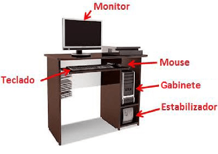

## Laboratorio de Fundamentos de Informática (LFUI)

---
## **Criar Usuário Sistema de Identificação Única**

1. Criar usuário para acesso ao moodle 
   - iu.cefetmg.br
1. Ambiente Moodle
   - ava.cefetmg.br
1. Contato:
   - marcaopamaral@gmail.com

---
## DISCIPLINA: **INTRODUÇÃO AOS COMPUTADORES E À INFORMÁTICA**

- Objetivos:
  1. Conhecer os conceitos básicos de informática de forma a possibilitar
     o uso de computadores em rotinas básicas e facilitar o aprendizado
  1. Familiarizar-se com:
     - Evolução e fundamentos da informática
     - Conceitos de _hardware_
     - Ferramentas e aplicação de informática
     - Diversos tipos de _software_
     - Configurações diversas

---
# Conteúdo Programático da Disciplina

---
## UNIDADE 1: **INTRODUÇÃO AOS COMPUTADORES E À INFORMÁTICA**

1. Definição de Informática
1. Breve História dos Computadores
1. Funções Básicas do Computador
1. Bits e Bytes
1. Bases de Numeração: Representação Decimal, Binária, Octal e Hexadecimal
1. Conversões de Números entre Bases
1. Aritmética Binária
1. Tipos de Dados e Suas Representações
1. Tabela ASCII

---
## UNIDADE 2: **CONCEITOS DE SISTEMA OPERACIONAIS**

1. Noções básicas de uso de Sistemas Operacionais
1. Conceitos de Diretório, Arquivo e File System
1. Comandos Básicos e Execução de Processos
1. Sistemas Operacionais MsDos, Windows e Linux

---
## UNIDADE 3: **PROCESSAMENTO DE TEXTO**

1. Processadores de texto disponíveis no mercado
1. Normas técnicas para formatação de trabalho científico
1. Tipos de Documentos e Modelos
1. Recursos avançados do Word
1. Tabelas, autoforma
1. Inserção de Objetos: Office Art, Figuras e Gráficos
1. Mala direta
1. Referência cruzada e índices

---
## UNIDADE 4: **PLANILHAS ELETRÔNICAS**

1. Planilhas eletrônicas disponíveis no mercado
1. Conceitos de arquivo, planilha e Célula
1. Criação de Fórmulas
1. Utilização de Funções
1. Formatação de células (formatação condicional).
1. Elaboração de Gráficos
1. Validação de Dados
1. Subtotais
1. Transferência de Informação entre o Excel e o Word
1. Acesso a fonte de dados externos via ODBC
1. Configuração de Páginas e Impressão

---
## UNIDADE 5: **PROGRAMAS DE APRESENTAÇÕES**

1. Orientações de Apresentação de conteúdos
1. Programas de Apresentações Disponíveis no Mercado
1. Tipos de Apresentação
1. Estruturação da Apresentação e Utilização de Modelos
1. Construção da Apresentação
1. Utilização de Fundos
1. Tipos de Slides
1. Inserção e Formatação de texto
1. Modos de Visualização
1. Potencialidades Multimídias
1. Gráficos, Tabelas e Organogramas
1. Impressão de Apresentações e Material de Apoio

---
## UNIDADE 6: **COMPONENTES DO COMPUTADOR**

1. Dispositivos de Entrada e de Saída
1. Unidade de Processamento
1. Dispositivos de Armazenamento
1. Tipos de Computadores
1. Componentes
1. Gabinete
1. Processadores e ventilação
1. Memória
1. Placa mãe
1. Vídeo, Rede, Modem
1. Fontes de Alimentação
1. Portas de Comunicação

---
## UNIDADE 7: **DISPOSITIVOS DE ARMAZENAMENTO**

1. Unidades de disco rígido
1. Unidades de disco sólida
1. Formatação
1. Tipos de sistemas de arquivos (Ex: FAT32, NTFS, EXT)
1. Configuração: física e lógica
1. Drives óticos (Ex: CD, DVD)

---
## UNIDADE 7: **CONFIGURAÇÕES**

1. Setup da BIOS/UEFI
1. Particionamento de disco
1. Instalação do sistema operacional

---
# Critérios de Avaliação

---
## 4 Bimestres

- 1º Bimestre: 20 pontos
- 2º Bimestre: 30 pontos
- 3º Bimestre: 20 pontos
- 4º Bimestre: 30 pontos

---
## Atividades Avaliativas

- Participação em sala de aula (20%)
- Entrega das atividades em sala (40%) 
- Prova (30%)

---
## Processamento de Dados

- Série de operações que se aplica a um conjunto de dados (entrada) para obter outro conjunto de dados ou resultados (saída).
   Ex.: dar baixa, no talão de cheques, de um cheque emitido; procurar um número de telefone na lista telefônica e anotá-lo em uma 
   caderneta; somar valores de compras no supermercado;
- Elementos Básicos:
  a) Dados iniciais: as informações iniciais são aquelas que estão sujeitas a certas transformações;
  b) Transformações: são as modificações efetuadas no conteúdo ou na forma dos dados iniciais;
  c) Resultados finais: o produto dos dados iniciais após as transformações.

---
## Tipos de Processamento de Dados

- Manual: é aquele feito manualmente, sem a utilização da máquina.
   Ex.: dar baixa, no talão de cheques, de um cheque emitido.
- Semi-automático: é quando operações são feitas por máquinas, mas exigem a intervenção humana.
   Ex.: rotinas de contabilidade que usam máquinas junto com processamento manual.
- Automático: é quando todo o processamento é feito por máquinas.
   Ex.: executar uma tarefa valendo-se exclusivamente de um computador.
- Para resolver determinados problemas, sobretudo de cálculo, o homem inventou máquinas chamadas COMPUTADORES que, uma vez programados, 
  efetuam o PROCESSAMENTO DE DADOS com muita rapidez e segurança, fornecendo os resultados desejados.

---
## Processamento Eletrônico de Dados


- É o processamento de dados com a utilização do computador. 
  Diz-se eletrônico porque os computadores atuais são formados por componentes eletrônicos.

---
## O Computador


- Computador é uma máquina capaz de variados tipos de tratamento automático de informações ou processamento de dados. Um computador pode 
  possuir inúmeros atributos, dentre eles armazenamento de dados, processamento de dados, cálculo em grande escala, desenho industrial, 
  tratamento de imagens gráficas, realidade virtual, entretenimento e cultura.

---
## O que é informática?

# INFORmação AutoMÁTICA

- Ciência que abrange todas as atividades relacionadas com o processamento automático de informações, inclusive o relacionamento entre 
  serviços, equipamentos e profissionais envolvidos no processamento eletrônico de dados.

---
## O que é computação?


- Computação pode ser definida como a busca de uma solução para um problema a partir de entradas (inputs) e tem seus resultados 
  outputs) depois de trabalhada através de um algoritmo
---
## Terminologia

- Dado: Informação que será trabalhada durante o processamento.
     - Exemplos: 10 (idade), 12 x 8 (pressão arterial), 1.99 (altura em metros), Maria (nome)
- Instrução: 
  - Operação elementar que o computador tem a capacidade de processar
  - Trabalha com os dados
  - Ordens executadas pelo computador
     - Exemplos: 
        - instruções para entrada e saída (E/S) de dados
        - instrução de movimentação de dados (transferência)
        - instruções aritméticas
        - instrução de comparação

---
# Atividade de Hoje


---
## _**Hour of Code**_ versão **Minecraft**
1. Tenha um email pessoal (Se não tiver, sugiro criar um no [Gmail](https://accounts.google.com/SignUp?service=mail))
1. Entre no site do _Hour of Code_: [https://code.org/mc](https://code.org/mc)
  1. Cadastre-se usando seu email
  1. Faça todos os 14 desafios e consiga seu certificado
1. Veja que editor de texto que seu computador possui, abra-o e crie um arquivo do tipo DOC ou ODF (Word ou Libre Office) com seu nome.
  - Envie o certificado de conclusão para o professor pelo ambiente (https://ava.cefetmg.br/mod/assign/view.php?id=1903)
  - Caso o Moodle ainda não tenha sido ativado, envie o certificado para [marcao@decom.cefetmg.br](mailto:marcaoo@decom.cefetmg.br)
    **com o assunto**:
    ```
    [LFUI] Certificado Hour of Code
    ```

