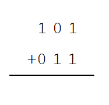
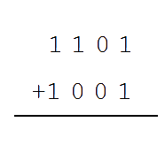
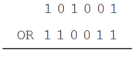

## Guia 7

- Assunto: Sistema de base numérico
- Objetivos:
  1. Praticar aritmética binária
  1. Praticar lógica binária
  1. Representação de números negativos

---
# Operações Binárias

- **A aritmética** é o conjunto de operações básicas de um conjunto de números:
  - ADIÇÃO, SUBTRAÇÃO, MULTIPLICAÇÃO e DIVISÃO
- Além das operações aritméticas, os números binários também possuem
  **operações lógicas**:
  - E, OU, NÃO
- Para algumas operações, vamos conhecer também formas para **representar números
  negativos**

---
## Roteiro

1. Representação de números binários
1. Operações aritméticas
1. Exercício 1
1. Operações lógicas
1. Exercício 2
1. Representação de números negativos

---
# Representação de números binários

---
# Operações aritméticas

---
## Adição de **dígitos** binários

- Considere todas as possibilidades de somas de dois dígitos binários:
  - `0 + 0 = 0`
  - `0 + 1 = 1`
  - `1 + 0 = 1`
  - `1 + 1 = 0` (e "vai um")

---
## Adição de **números** binários

- Exemplo: `101 + 011`

  
- Conferindo: `5 + 3 = 8`

---
## Exemplo de adição de números binários

- Exemplo: `1101 + 1001`

  
- Conferindo: `13 + 9 = 22`

---
## Subtração de **dígitos** binários

- Considere todas as possibilidades de subtração de dois dígitos binários:
  - `0 - 0 = 0`
  - `1 - 0 = 1`
  - `1 - 1 = 0`
  - `0 - 1 = 1` e "pede emprestado 1" para o dígito de ordem superior

---
## Subtração de **números** binários

- Exemplo: `101 - 011`

  
- Conferindo: `5 - 3 = 2`

---
## Multiplicação de **dígitos** binários

- Considere todas as possibilidades de multiplicação de dois dígitos binários:
  - `0 x 0 = 0`
  - `0 x 1 = 0`
  - `1 x 0 = 0`
  - `1 x 1 = 1`

---
## Multiplicação de **números** binários

- Exemplo: `101 &#x00D7; 011`

  
- Conferindo: `5 x 3 = 15`

---
## Divisão de **números** binários

- Mesmo método que o decimal: deslocamentos e subtrações
- Exemplo: `10110 &#x00F7; 10`

  
- Conferindo: `22 &#x00F7 2 = 11`

---
# Exercício 1

- Resolva as operações abaixo e coloque suas respostas no Moodle:
  <ol class="multi-column-list-2">
    <li>`1001 + 0001 =`</li>
    <li>`1001 - 0001 =`</li>
    <li>`1001 - 0010 =`</li>
    <li>`1000 + 0001 =`</li>
    <li>`1101 &#x00D7; 1100 =`</li>
    <li>`10101 &#x00F7; 11 =`</li>
    <li>`1000 + 0101 &#x00D7; 1100 =`</li>
    <li>`(0010 - 0001) &#x00D7; 1011 =`</li>
    <li>`0010 - 0001 &#x00D7; 1011 =`</li>
    <li>`1011`2` =`</li>
    <li>`111110 &#x00F7; 10 =`</li>
    <li>`111111 &#x00F7; 11 =`</li>
  </ol>

---
# Operações **lógicas**

---
## Operação **NOT** (não)

- A operação NOT é a negação de cada bit, ou seja, simplesmente inverte-se
  o valor de cada bit
- Exemplo:
  1. `NOT 1 = 0`
  1. `NOT 0 = 1`
  1. `NOT 101 = 010`
  1. `NOT 10100 = 01011`

---
## Operador **AND** (e)

- A operação AND resulta em 1 apenas quando os dois operandos são 1
- Todas as combinações para cada operando sendo apenas de 1 bit:
  1. `1 AND 1 = 1`
  1. `1 AND 0 = 0`
  1. `0 AND 1 = 0`
  1. `0 AND 0 = 0`
- 
  Exemplo: `101001 AND 110011`

---
## Operador **OR** (ou)

- A operação OR resulta em 1 se qualquer operando for 1
- Todas as combinações para cada operando sendo apenas de 1 bit:
  1. `1 OR 1 = 1`
  1. `1 OR 0 = 1`
  1. `0 OR 1 = 1`
  1. `0 OR 0 = 0`
- 
  Exemplo: `101001 OR 110011`

---
# Exercício 2

- Resolva as operações abaixo e coloque suas respostas no Moodle:
  <ol class="multi-column-list-2">
    <li>`1001 AND 1111 =`</li>
    <li>`1001 AND 0000 =`</li>
    <li>`1001 AND 0001 =`</li>
    <li>`1001 OR 0000 =`</li>
    <li>`1001 OR 1111 =`</li>
    <li>`1001 OR 1100 =`</li>
    <li>`(1001 AND 0011) OR 1101 =`</li>
    <li>`NOT 1000 =`</li>
    <li>`NOT (1100 AND 0101) =`</li>
    <li>`(NOT 1010) OR 0010 =`</li>
  </ol>

---
# Representação de números negativos

---
## Bits disponíveis

- Um computador possui uma **memória finita**, o que faz com que seja necessário
  determinar um **número máximo de bits para representar números**
  - Esse número máximo varia de acordo com o _hardware_. Exemplos de video-games:
    - Nintendo: 8 bits
    - Super Nintendo: 16 bits
    - Nintendo 64: 64 bits
- Em computadores, esse número é de **32 ou 64 bits**, dependendo da arquitetura (x86 ou AMD64)
- Pergunta: qual é o maior número que pode ser representado em 32 bits? (continua...)

---
## Números em 32 bits

- Pergunta: qual é o maior número que pode ser representado em 32 bits?
  - Para ajudar, vamos agrupá-los por byte (de 8 em 8 bits):
    `11111111 11111111 11111111 11111111`
  - Convertendo esse número para a base decimal, temos: 4.294.967.295 (4 bilhões...)
- Ou seja, podemos contar de 0 até 4.294.967.295
- Mas e quanto aos **números negativos**?

---
## Números negativos

- Precisamos de um jeito para diferenciar um número negativo de um número positivo
- Uma opção é separar o **bit mais significativo** (mais à esquerda) para definir
  se o sinal é + ou -. Por exemplo:
  - Se o bit vale 1, é negativo
  - Se o bit vale 0, é positivo
  - Daí teríamos ainda 31 bits para representar números
    - Com 31 bits é possível chegar até o número 2.147.483.647 (2 bilhões...)
    - Então poderíamos representar [-2 bilhões, +2 bilhões[
  - Essa forma se chama **sinal/magnitude**

---
## Exemplo de número negativo (usando sinal/magnitude)

- Neste exemplo, estamos usando números com 7 bits

---
## Números negativos (usando **complemento a dois**)

- Uma segunda forma de representar os números com sinal é usando a operação
  de **complemento a dois**
  - O complemento a dois de um número é outro número que pode ser encontrado usando
    a fórmula:
    `C = (2``n``) - original`, em que
      - `C` é o complemento que queremos encontrar,
      - `n` é o número total de bits e
      - `original` é o número do qual queremos
    encontrar o complemento
    - Exemplo: encontrar complemento de `10110`: `(2``5``) - 10110 = ` **`01010`**
