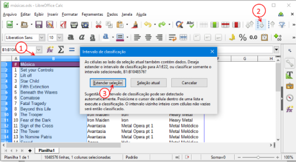
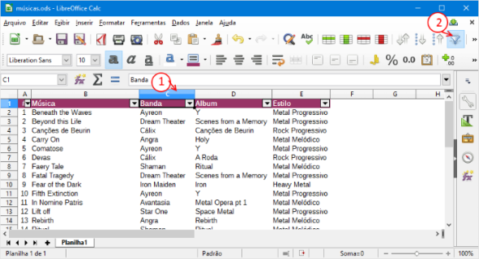
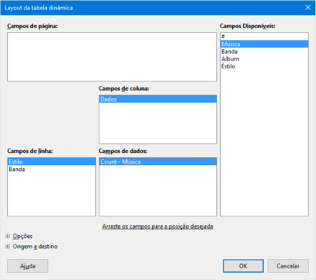

## Guia Planilhas Eletrônicas - 3

- Assunto: **Planilhas eletrônicas**: Calc
- Objetivos:
  1. Classificar (ordenar) dados
  1. Usar filtros
  1. Tabelas dinâmicas

---
## Exercício - **parte 1**

- Crie uma planilha contendo **as 30 músicas que você mais escutou** nos últimos tempos
  - Você deve ter músicas de pelo menos 3 bandas e 2 estilos
    diferentes
- Organize assim:
  1. Primeira linha: cabeçalho com nome das colunas
  1. Demais: uma música por linha
  1. Colunas:
    - Número da música (de 1 a 12)
    - Música
    - Banda
    - Album
    - Estilo musical (e.g., Rock, Pop, Metal etc.)
    - Quantas vezes você escutou a música    

---
## Exercício - **parte 2**

- Formate como uma tabela em que a primeira linha (cabeçalho)
  fique destacada das demais

---
## Exercício - **parte 3**

- Ordene alfabeticamente por nome da música
  - Faça isso em 30 segundos em vez de 30 minutos:

    

---
## Exercício - **parte 4**

- Crie uma visão da tabela mostrando apenas as músicas do seu
  **estilo de música favorito** (apenas 1)
  - 
    Para isso, crie um filtro por coluna:
- Tire uma _screenshot_ da tabela "filtrada" pelo estilo preferido
- Cole a _screenshot_ em uma segunda planilha no mesmo arquivo

---
## Exercício - **parte 5**

- Crie outra visão mostrando o número de músicas por banda e por álbum
  - Para isso, você vai criar uma **tabela dinâmica** do Calc
  - Veja nos próximos slides como fazer
- Tire uma _screenshot_ dessa visão e cole-a em uma terceira planilha no mesmo arquivo

---
## Tabela Dinâmica (1/2)

---
## Tabela Dinâmica (2/2)

---
## Exercício - **parte 6**

- Crie um gráfico de pizza mostrando a porcentagem
  das músicas em cada estilo de música

---
## Exercício - **parte 7**

- Crie uma tabela dinâmica mostrando a **soma das escutas
  de músicas** para cada álbum de cada banda

---
## Entrega

- Entrega via **Moodle** até o final **desta aula**
