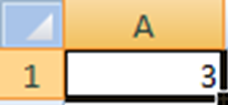

## Guia Planilhas Eletrônicas - 5

- Assunto: **Planilhas eletrônicas**: Calc
- Objetivos:
  - Praticar o uso de Referências e Funções
    - referência relativa
    - referência absoluta
    - referência mista
    - funções
 
---
## Tela Inicial Calc

---
## Operadores
- São utilizados para efetuar as operações de cálculo.
    - "=  : Utilizado para iniciar um cálculo (Regra para todas as operações)" 
    - "+  : Adição" 
    - "-  : Subtração"
    - "*  : Multiplicação"
    - "/   : Divisão"
    - "^ : Raiz Quadrada"

---
## Exemplos de utilização  dos operadores
- Adição : = A1+A2+A3 
- Subtração : =A1-A2
- Multiplicação : =A1*A2
- Divisão: =A1/A2
- Raiz Quadrada : = A1^2 (neste caso o número 2, mostra que esta célula (A1) será elevada ao quadrado)

### Obs: Sempre que iniciarmos uma operação utilizaremos o "=" na barra de formula

---
## Referêcias

- Quando efetuamos uma operação fazemos o calculo em cima de células ou endereço de célula e não o seu conteúdo
- No exemplo da figura usaremos a célula A1 e não o conteúdo 3.
- Assim, se a celula B1 = A1, o valor de B1 será 3.

---
## Referência de Outra(s) Planilha(s)
- Utilizada para retornar um resultado que foi obtido em outra planilha
  - Ex: =Plan1!C4, Onde Plan1! é o nome da planilha que contém o valor obtido 
    e C4 é a Célula da planilha referenciada que contém o valor obtido
  - Se C4 = 3 na planilha Plan1 e A1 = Plan1!C4, então A1 = 3

---
## Referêcias

- São utilizadas para agilizar nossos cálculos, a fim de poupar tempo utilizando dados de outra(s) células. 
- São divididas em três tipos:
   - Referência Relativa
   - Referência Absoluta
   - Referência Mista

---
## Referêcia Relativa

- É a mais comum e é utilizada através da Alça de preenchimento "+" onde a arrastamos para efetuar os cálculos. 

---
## Referêcia Absoluta

- É quando um dos valores envolvidos na fórmula permanece sempre em uma mesma célula.
  Para ativa-la devemos utilizar o caractere $ para fixarmos uma célula.

---
## Referêcia Mista

- É quando trabalhamos com fórmulas que possuem linhas ou colunas fixadas. 
  Para ativa-la devemos utilizar o caractere $ para fixarmos uma linha ou coluna.

---
## Formulas
- São operações que o usuário cria, utilizando operadores (multiplicação, soma, divisão, 
  multiplicação, exponenciação e operandos. 
- Os operandos são valores fixos, células e eventualmente funções.
    - Ex: =A1+A2+A3+A4+A5
    - Ex: =A1+A2-A3*A4/A5

---
## Funções
- São cálculos pré-programados que já existem no Excel / Calc. 
    - Ex: =Soma(A1:A5), que representa A1+A2+A3+A4+A5
    
---
## Estrutura de uma Função

---
## Algumas Funções
- Função Soma: Utilizada para fazer o somatório de um grupo de células.
   - Ex: =Soma(A1:A5)
- Função Média: Utilizada para fazer a média aritmética de um grupo de células.
   - Ex: =Media(A1:A5)
- Função Mod: Utilizada para retornar o resto de uma divisão entre células.
   - Ex: =Mod(A1;A2)
   - Se A1=20 e A2=4 o resultado de mod será 0

---
## Função Se
- Utilizada para realizar um teste, mediante a uma condição que retornará um valor verdadeiro ou um valor falso.
  - Ex: =Se(a6<=50;”Barato”;”Caro”)
    - A6 é a célula a ser testada
    - Condição usada para teste: <=50            
    - Condição verdadeira: “Barato”            
    - Condição Falsa: “Caro”            
