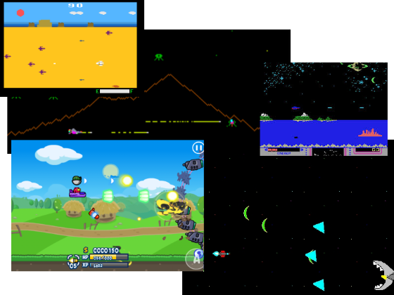
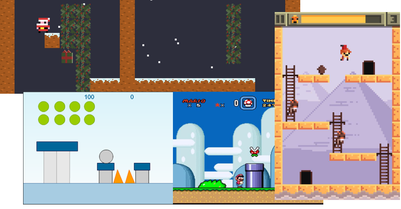
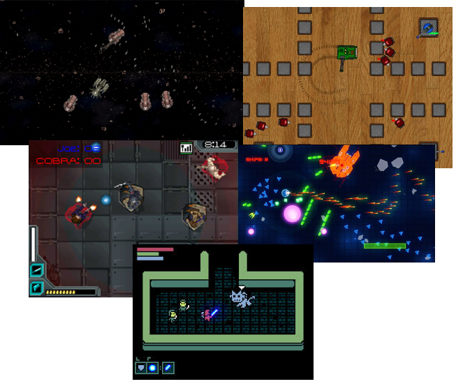
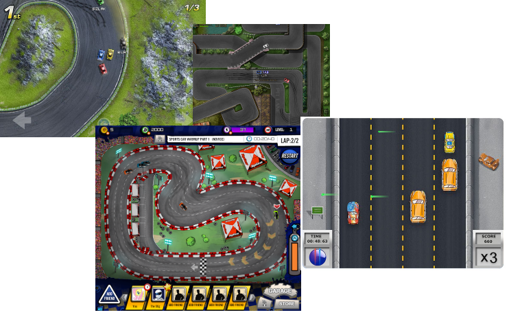

# Projeto

---
## Descrição

- Você deve criar um pequeno jogo usando a plataforma [flowlab](http://flowlab.io)
- Você tem liberdade para **escolher o tipo de jogo** que deseja fazer, mas
  deve seguir alguns critérios que serão descritos mais adiante
- O trabalho deve ser feito em **duplas**, mas pode ser feito individualmente
- Valor do trabalho: **8 pontos**

---
## O que seu jogo **deve** conter?

- Os seguintes itens correspondem a 80% da nota do trabalho:
  1. Um personagem principal
     - Que pode ser controlado
     - Que possui animações básicas para se locomover
  1. Um cenário
  1. Jogabilidade básica
  1. Um objetivo claro e bem definido (por exemplo, chegar ao outro lado do
     cenário sem morrer)

---
# Sugestões de jogos

---
## Um jogo de navinha

---
## Um jogo de plataforma

---
## Um jogo _top-down_

---
## Um jogo de corrida

---
## Como consigo 100% dos meus pontos?

- Para conseguir os outros 20% (ou até mais), você pode implementar
  um conjunto de itens extras, descritos a seguir
  - A nota do trabalho pode exceder 100%, mas limitada a 150%
- Itens extras:
  1. (5%) Jogabilidade inédita, ou diferente do comum
  1. (3%/cada) Fase além da primeira (limite de 5)
  1. (10%) Ter um "chefão", ou uma fase mais complicada
  1. (5-15%) Inimigos "espertos"
  1. (5%) Gráficos bem criados
  1. (5-10%) Animações diversas (andando, saltando, abaixando, atirando,
      invencível etc.)
  1. (5-15%) Itens ou armas
  1. (??%) Adicionais propostos por você, avaliados pelo professor

---
# Entrega

- A data final do trabalho é **20/01/14 (terça-feira)**, às 23:59
  - Não haverá chances de adiamento
- Você deve entregar um **arquivo .zip** no **Moodle** contendo:
  - Duas fotos da tela do seu jogo mostrando diferentes aspectos (foto1.jpg, foto2.jpg)
  - Um arquivo texto (descricao.txt) contendo:
    1. A URL para seu jogo
    1. Um parágrafo descrevendo seu jogo
    1. A lista de **itens adicionais** que você está pleiteando
