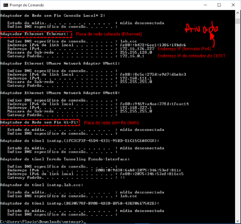

# Informática e Redes

- Disciplina: **Laboratório de Fundamentos de Informática**
- Professor: **[Flávio Coutinho](mailto:coutinho@decom.cefetmg.br)**

---
## Guia 15

- Assunto: **Internet**
- Objetivo:
  1. Entender o funcionamento da Internet como **"usuário"** e como
**técnico**

---
## Roteiro

1. Assistir os 2 vídeos sobre **como a Internet funciona** (40 min)
1. Descobrir alguns **endereços IP** (20 min)

---
# Parte 1: Como a **Internet** funciona

---
## Guerreiros da Rede [no Youtube](https://www.youtube.com/watch?v=hymzoUpM0K0)

<video width="640" height="360" class="left-aligned" poster="images/poster-video-guerreiros-da-rede.jpg" controls>
  <source src="attachments/guia15/guerreiros-da-rede.mp4" type="video/mp4" />
</video>

---
# Parte 2: Usando protocolos

---
## Como funciona a Internet? Parte 1: O protocolo IP [no Youtube](https://www.youtube.com/watch?v=HNQD0qJ0TC4)

<video width="640" height="360" class="left-aligned" poster="images/poster-video-protocolo-ip.jpg" controls>
  <source src="attachments/guia15/protocolo-ip.mp4" type="video/mp4" />
</video>

---
## Sobre o vídeo

- Quem produziu o vídeo foi a **[NIC.br](http://nic.br/)**
  - Eles são parte do **Comitê Gestor da Internet** no Brasil ([CGI.br](http://cgi.br/))
  - O CGI foi instituído [em 1995 pelo Ministério das Comunicações](http://cgi.br/historicos/#1995)
  - O que eles fazem? Por exemplo:
    1. Se você quiser ter um site com final ".br", deve adquirir o direito com eles em [http://registro.br](http://registro.br)
      - Professor, quanto custa?
        - R$ 30,00 por ano
    1. Se você precisar que seu site seja criptografado, deve adquirir um certificado em [http://cert.br](http://cert.br)
- Há mais vídeos curtinhos sobre como funciona a Internet lá
  1. [Parte 2: Sistemas Autônomos, BGP, PTTs](https://www.youtube.com/watch?v=C5qNAT_j63M)
  1. [Parte 3: DNS](https://www.youtube.com/watch?v=ACGuo26MswI)... etc.

---
## O **endereço IP**

<p class="note" style="width: 63%">
  O endereço IP é **um conjunto de 4 números de 8 bits cada** usado para identificar computadores e outros
  dispositivos conectados em rede.
</p>


---
## Endereço IP de um computador

- Um computador **tipicamente** possui uma ou **duas placas de rede**
  - Uma placa Ethernet (para rede com cabos)
  - Uma placa WiFi (para rede sem fio)
- Cada placa de rede possui **um endereço IP**, que é:
  <p class="note" style="width: 80%;">
    Um **endereço IP privado** é utilizado para distinguir
    um computador em uma <abbr title="Local Area Network">LAN</abbr> (**rede local**)
  </p>
- Se o computador tem acesso à Internet, ele precisa de um:
  <p class="note" style="width: 80%;">
    Um **endereço IP público**, utilizado para **identificar o computador na Internet** ou em
    outra <abbr title="Wide Area Network">WAN</abbr> (**rede de longa distância**)
  </p>

---
# Parte 2: Exercício

1. Descubra o IP privado e o IP público do seu computador.
1. Defina qual é seu site favorito ou aquele de que você menos gosta.
1. Descubra qual o IP do site escolhido.
1. Descubra em que cidade fica o servidor que hospeda o site escolhido.
1. Entregue as respostas via **Moodle**, incluindo os comandos
   utilizados para chegar até elas.

---
## Para descobrir o IP privado das placas de rede

- No Windows:
  ```
  ipconfig
  ```
- No Linux:
  ```
  ifconfig
  ```

---
## Exemplo de saída do comando **ipconfig**


---
## Exemplo explicado



---
## Para descobrir o IP público

- Para acessar a Internet, precisamos de um IP público
- Contudo, para ter um IP público, precisa-se "alugá-lo" de um Provedor de Acesso à Internet (<abbr title="Internet Service Provider">ISP</abbr>)
- Como seria caro alugar um para cada computador da sua casa/empresa/instituição, tipicamente **alugamos apenas um**
  e o usamos no **roteador para compartilhar a conexão** com todos os computadores
- Cada computador conhece esse roteador como o **_gateway_ padrão**
- Para descobrir qual o IP público do roteador, a melhor forma é ["perguntar à Internet"](http://www.google.com.br/search?hl=pt-BR&q=qual+%C3%A9+meu+endere%C3%A7o+IP&meta=)

---
## Para descobrir o endereço IP do computador hospedando um site

- Todo site é simplesmente um conjunto de arquivos que ficam
  em um computador que fica ligado 24/7 e sempre conectado à Internet
  - Quando entramos no site, estamos fazendo _download_ dos arquivos e
    mostrando eles no navegador
- Sendo assim, o endereço de um site é um texto
  (<abbr title="por exemplo">_e.g._</abbr>, http://www.omo.com.br),
  mas que está mapeado em um endereço IP (do computador que está
  hospedando os arquivos)
- Para descobrir o IP, pode-se usar o **comando** (Windows, Linux) **`ping`**
  para enviar um pacote de dados para o endereço do site. Por exemplo:
  ```
  ping www.omo.com.br
  ```  


---
## Mais referências

- [Como determinar o endereço IP privado e público](http://www.howtogeek.com/117371/how-to-find-your-computers-private-public-ip-addresses/)
- [Endereço IP na Wikipedia](http://pt.wikipedia.org/wiki/Endere%C3%A7o_IP)
- [Ferramenta de consulta de geo-localização de IPs](http://www.geoiptool.com/)
