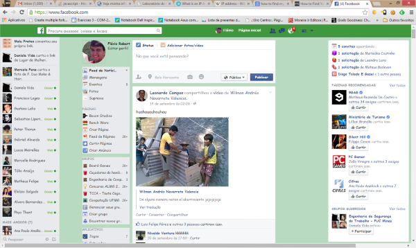

---
Além disso, o IP pode ser:
  - **estático**, se ele é atribuído ao computador (à placa de rede, na verdade)
  por meio de configuração, ou
  - **dinâmico**, se ele é atribuído por um servidor DHCP (um roteador ou outro
    dispositivo com essa função)

---
# Parte 3: *Hackeando* o Facebook

---

1. Navegue para o Facebook, ou qualquer outro site, no seu navegador predileto.
1. Abra as ferramentas de desenvolvedor (normalmente, F12 ou Ctrl+Shift+I).
1. Brinque com as propriedades (cor, tamanho, fonte) dos elementos da página e
   deixe-a bem diferente do que ela é.
1. Tire uma _screenshot_ e envie no **Moodle** também.

---

---
# Para a **próxima aula**
_**(Falhas) de Segurança** na Internet e em Computadores_

---
_Enunciado_: Escrever uma resenha sobre 2 tipos de ciberataque escolhidos da
lista a seguir. Sobre cada item, você deve explicar o que é e como funciona e
o que pode ser feito para proteger um computador desse tipo de ataque.

- DDOS (_Distributed Denial of Service_ ou Negação de Serviço Distribuída)
- XSS (_Cross-site_ scripting ou Scriptagem entre sites)
- Trojans (ou Cavalos de Tróia)
- Vírus
- _Malwares_

_Limite_: 1 página para cada item

_Entrega_: **Moodle** até 23 de Setembro de 2014
