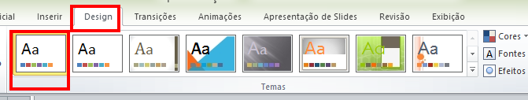
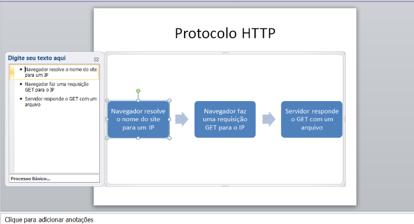
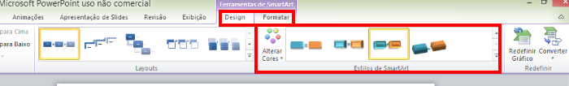
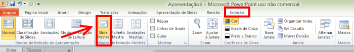
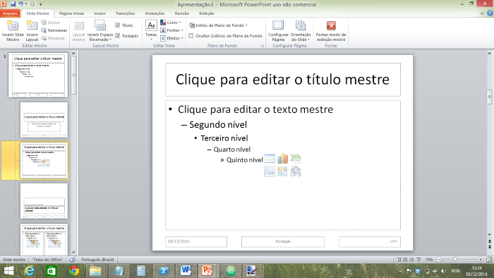
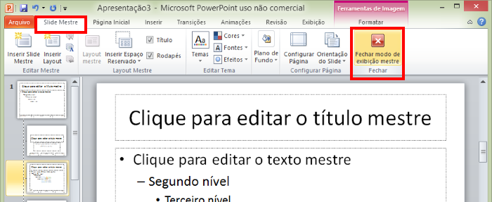

# Informática - REDES

- Disciplina: **Laboratório de Fundamentos de Informática**
- Professor: **[Flávio Coutinho](mailto:coutinho@decom.cefetmg.br)**

---
## Guia **24**

- Assunto: **Apresentações**: Powerpoint - parte 2 e Prezi
- Objetivos:
  -	Tipos de Apresentação
  - Slide mestre
  - Gráficos, Tabelas e Organogramas
  - Ferramentas alternativas

---
## Enunciado

- Na aula de hoje, você vai aprimorar a apresentação do Powerpoint que criou na
  última aula e também criar uma versão alternativa dela usando uma ferramenta
  online chamada Prezi  
- Mas, primeiro, vamos relembrar algumas recomendações para a
  criação de apresentações em geral

---
# Orientações de Apresentação de conteúdos

---
## Recomendações (relembrando)

- Preferir utilizar tópicos, e não parágrafos grandes
  - O uso de slides cheios de textos dificulta o acompanhamento da pessoa
    que está assistindo a sua apresentação
- Não usar textos com fontes menores que **24pt**
  - Para que mesmo quem está no fundo da sala consiga enxergar
- Usar um esquema de cores de alto contraste
- Não "poluir" os slides com informação demais

---
## Ponto de partida

- Faça _download_ do seu trabalho da última aula (`guia18.pptx`). Você
  consegue acessar o arquivo enviado, usando a interface do Moodle
  - Caso não tenha vindo na última aula, peça a apresentação de um colega

---
# Parte 1: Powerpoint - aula 2

---
## 1º passo

- Vamos remover o tema que utilizamos na última aula, já que vamos
  personalizar a apresentação por conta própria

  

---
## 2º passo

- Crie um novo slide na apresentação na posição 10
  - Título: "Processo do Protocolo HTTP"
  - Conteúdo: a lista ordenada abaixo
    1. Navegador resolve o nome do site para um IP
    1. Navegador faz uma requisição GET para o IP
    1. Servidor responde o GET com um arquivo

---
## 3º passo - _SmartArts_

- Agora, vamos melhorar a aparência das nossas listas de tópicos
- À partir do Office 2007, o Powerpoint contém um recurso de personalização das
  listas de tópico chamado **_SmartArt_**
- Vamos transformar os tópicos do slide 10 em um "processo básico"

  

---
## 3º passo - _SmartArts_ (cont.)

- 
  Selecione "Mais Elementos Gráficos SmartArt..." para ter acesso à lista
  completa de possibilidades de transformação
- Na janela, selecione "Processo" e "Processo Básico" em seguida

  

---
## 3º passo - _SmartArts_

- O slide ficará parecido com a figura abaixo:

  

---
## 3º passo - _SmartArts_

- Você ainda pode alterar as cores e os estilos das figuras criadas

  
- Altere seu _SmartArt_ para uma paleta de cores diferente e também use um
  estilo diferente do padrão

---
## 4º passo

- Escolha **outros 2 slides** que possuem uma lista de tópicos e **converta
  suas listas para _SmartArt_**
  - Na hora de escolher o _layout_ (tipo) do _SmartArt_, considere o
    significado dos tópicos da lista
    - Por exemplo, a lista do slide 10 representa um processo. Por isso,
      escolhemos um _layout_ do tipo "processo"

---
## 5º passo - Slide mestre

- Agora, vamos colocar a logomarca do CEFET no canto inferior esquerdo de cada
  slide
  - Uma alternativa é inserir a imagem em cada slide
    - Imagina se, em vez de 10 slides, tivéssemos 100?
  - Outra forma, a que vamos utilizar, é por meio do **slide mestre**
- Faça _download_ aqui da logo do CEFET:

  

---
## 5º passo - Slide mestre (cont.)

- O **slide mestre** é como uma "forma de fazer bolo", só que de slides :)
  - O termo correto é **_template_**, que algumas pessoas traduzem para modelo
- Para acessar/alterar o slide mestre acesse a aba "Exibição", seção "Modos
  de Exibição Mestres":

  

---
## 5º passo - Slide mestre (cont.)

- No modo de slide mestre, o Powerpoint mostra todos os **tipos de slide** para
  que possamos alterar um a um

  

---
## 5º passo - Slide mestre (cont.)

- Selecione o 3º tipo de slide - aquele que mostra um título no alto e uma
  lista de tópicos no espaço de conteúdo
- Insira a logomarca do CEFET e posicione-a no canto inferior esquerdo, como
  na imagem

  

---
## 5º passo - Slide mestre (cont.)

- Vamos agora deixar a logomarca menos visível, de forma que ela não fique
  chamando muita atenção do conteúdo dos slides
  1. Selecione a imagem
  1. Na aba "Formatação", seção "Ajustar", escolha a opção "Cor" e, em seguida,
     a opção cinza claro

     

---
## 5º passo - Slide mestre (cont.)

- Agora, vamos **sair do modo de slide mestre** e voltar ao modo normal
  - Para isso, na aba "Slide Mestre", clique no botão "Fechar modo de exibição
    mestre"

  

---
## Entrega da **primeira parte**

1. Salvar como guia19.pptx
1. Entregar **via Moodle** no horário **desta aula**

---
# Parte 2: Prezi

---
## Enunciado

- Você deve recriar a apresentação da última aula usando o Prezi
- http://www.prezi.com
- Para isso, você vai precisar criar uma conta gratuita no site
- Use o mesmo conteúdo da apresentação `guia18.pptx`, porém aprenda e explore
  os recursos exclusivos do Prezi para tornar sua apresentação mais chamativa

---
## Entrega da **segunda parte**

1. Descubra qual o link da sua apresentação no Prezi
1. Entregar **via Moodle** no horário **desta aula**
