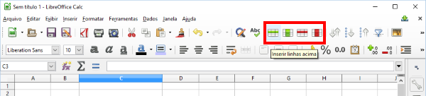
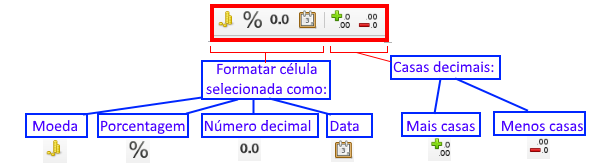
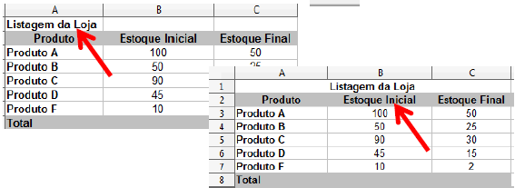
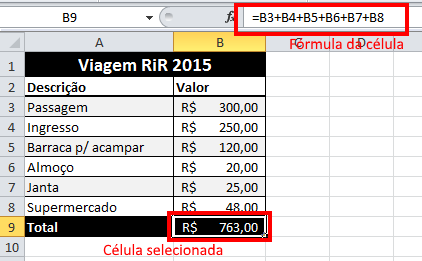
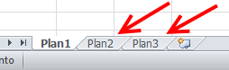
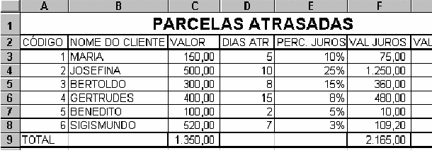

## Guia Planilhas Eletrônicas - 1

- Assunto: **Planilhas eletrônicas**: Calc
- Objetivos:
  1. Conhecer os conceitos básicos
  1. Praticar formatação básica, preenchimento de células, referências
  1. Praticar o uso de fórmulas simples

---
## Roteiro

1. Conceitos básicos
1. Formatação
1. Fórmulas
1. Exercícios (1 e 2)

---
# Conceitos básicos

---
## O que é o Calc?

- O Calc é o programa de **planilha eletrônica** do LibreOffice
  - Você pode fornecer dados (em geral, numéricos) em uma planilha e
    **manipulá-los para produzir determinados resultados**
- Outras funcionalidades
  - **Funções**, que podem ser utilizadas para criar **fórmulas** para executar
    **cálculos complexos**
  - Geração de **gráficos dinâmicos** a partir de tabelas
  - **Importação e exportação de planilhas** em vários formatos, incluindo
    HTML, CSV, PDF, entre outros...

---
## Interface do Calc (5.0.5.X)

---
## Conceitos

- **Planilha**: conjunto de células dispostas em **linhas** e **colunas**
- **Célula**: um espaço onde se pode escrever algo
  - É identificada por uma coluna (letra) e uma linha (número)
  - Por exemplo, `A1`, `B1`, `D10` (tipo batalha naval)
- Cada documento do excel pode conter várias planilhas (abas)

---
## Selecionando Células

- Célula única
  - Clique com o botão esquerdo do mouse sobre a célula
- 
  Grupo de células contínuas
  1. Clique em uma célula
  1. Pressione e arraste o botão esquerdo do mouse por outras células

---
## Selecionando células (cont.)

- Grupo de células não-contínuas
  1. Selecione a primeira célula
  1. Pressione e segure a tecla <kbd>Ctrl</kbd>
  1. Clique nas demais células que deseja selecionar

---
## Selecionando linhas e colunas <u>inteiras</u>

1. Clique no cabeçalho da primeira linha ou coluna que deseja selecionar
1. Arraste até a última linha ou coluna a contemplar

---
## Selecionando a planilha inteira

- Clique entre o cabeçalho das colunas e linhas da planilha

---
## Inserindo linhas e colunas

- Utilizando a guia "Inserir"
  1. Selecione uma célula
  1. Clique em Inserir Linhas na Planilha (ou Colunas)
    
- Utilizando o mouse
  1. Clique com o botão direito do mouse no cabeçalho da coluna ou da linha onde você deseja fazer a inserção
  1. Clique em "Inserir"

---
## Apagando linhas e colunas

1. <video autoplay controls="false" loop poster="../../images/calc-exclusion-poster.png" style="float:right;">
    <source src="../../videos/calc-exclusion.webm" type="video/webm">
  </video>
  Selecione a coluna ou a linha que quer apagar
1. Clique com o botão direito no identificador da coluna ou linha
1. Selecione "Excluir" do menu

---
## Preenchimento automático de células

1. <video autoplay controls="false" loop poster="../../images/calc-autofill-poster.png" style="float:right;">
    <source src="../../videos/calc-autofill.webm" type="video/webm">
  </video>
  Preencha a(s) célula(s) com os valores iniciais da sequência
1. Selecione a(s) célula(s) preenchida(s)
1. Clique na "alça", no canto inferior direito da célula e arraste-o na direção desejada para preencher as demais células automaticamente

---
# Formatação

---
## Formatação

- A formatação é realizada nas células que estiverem selecionadas
- O conjunto de ferramentas de formatação é bastante semelhante àquele que
  vimos do Writer

---
## Formatação (cont.)

---
## **Mesclando** células

- Mesclar células (Unir 2 ou mais células) **pode ser feito em 2 passos:**
  1. Selecione as células que deverão ser unidas
    

---
## **Mesclando** células (passo 2)

1. Clique no ícone **Mesclar** da barra de ferramentas
  

---
# Fórmulas

---
## Fórmulas simples

- **Uma fórmula é uma instrução para o Calc fazer um cálculo**, em vez de
  guardar um número
  - Por exemplo, uma fórmula pode conter a **soma de todos os gastos** feitos
    para ir ao **Rock In Rio 2015**
    

---
## Fórmulas: operadores aritméticos

- Todas as fórmulas no Calc devem começar com o caractere `=` (igual),
  pois é desta maneira que programa entenderá que a entrada é uma fórmula
  e não um texto ou número
- 
  Exemplo de Fórmulas
- Operadores Aritméticos
  - \+ Soma
  - \- Subtração
  - \* Multiplicação
  - / Divisão
  - ^ Potenciação
  - % Porcentagem

---
## Somando valores de células

- <video autoplay controls="false" loop poster="../../images/calc-formula-poster.png" style="float:right;">
    <source src="../../videos/calc-formula.webm" type="video/webm">
  </video>
  Somando valores de células (exemplo RiR):
  1. Coloque igual (=) na célula que vai receber o cálculo da soma
  1. Selecione o primeiro valor (em uma célula)
  1. Pressione mais (+)
  1. Selecione o segundo valor (em uma célula)
  1. Pressione Enter
- **PS**: Se você deseja somar mais de duas células, repita os passos 2 e 3 (i.e., selecionar os valores e colocando “+” entre eles) e só digite Enter quando todos os valores que você deseja somar estiverem na lista

---
## Somando usando a função SOMA()

- <video autoplay controls="false" loop poster="../../images/calc-add-function-poster.png" style="float:right;">
    <source src="../../videos/calc-add-function.webm" type="video/webm">
  </video>
  Além das fórmulas, existem funções, como a `SOMA(células)`
  - Passa-se um **intervalo de células** (_e.g._, `B3:B8`) para a função
  - **`B3:B8`** significa: todas as células entre `B3` até `B8`, incluindo
    as duas
    - Esta forma é preferível em vez de `B3+...+B8` porque é mais sucinta

---
## Copiando fórmula entre células

- Uma fórmula, pode ser copiada para outras células de uma mesma linha ou coluna
- <video autoplay controls="false" loop poster="../../images/calc-copy-formula-poster.png" style="float:right;">
    <source src="../../videos/calc-copy-formula.webm" type="video/webm">
  </video>
  Para isso basta:
  1. Selecionar a célula onde a fórmula foi inserida
  1. Clique na “alça”, no canto inferior direito da célula e arraste-o na direção desejada para preencher as demais células
    - **PS:** A fórmula será copiada, entretanto o cálculo será efetuado de acordo com os valores presentes nas células relacionadas

---
# Exercícios

---
## Entrega

- Entrega via **Moodle** até o final **desta aula**
- Você deve entregar **um único arquivo com a extensão `ods`** contendo as
  duas planilhas que você criar nos exercícios 1 e 2

---
## Exercício **1**

- Crie um arquivo no Calc com o nome `guia-calc-pt1.ods`
- Deixe apenas a primeira planilha e exclua as outras duas
  
- Construa, na primeira planilha, a tabela abaixo:
  

---
## Exercício **1** (cont.)

- Pede-se:
  1. A coluna Imposto deve ser preenchida da seguinte forma:
     - Se Categoria = 1, imposto é 10% (0,1)
     - Se Categoria = 2, imposto é 15% (0,15)
  2. Calcule a coluna **Total Produto** = somatório das vendas em MG, RJ e SP
     de cada produto. O total produto deve possuir 2 casas decimais e
     separador de milhares
  3. Calcule a linha **Total região** = somatório das vendas de cada estado.
     O total região deve possuir 2 casas decimais e separador de milhares

---
## Exercício **2**

- No **mesmo arquivo**, crie uma nova planilha e construa a tabela abaixo:

  

---
## Exercício **2** (cont.)

- Pede-se:
  1. No fim da Tabela, crie duas colunas: **Valor Juros e Valor a Pagar**
  1. Calcule, para cada linha das colunas criadas:
    1. **Valor Juros** = (Dias Atr \* Perc.Juros) \* Valor
    1. **Valor a pagar** = Valor + Valor Juros
  1. Insira uma **linha antes da linha do TOTAL**
    1. Escreva "MÉDIA" na coluna A dessa linha
    1. Na **coluna F calcule a média do valor dos juros**
