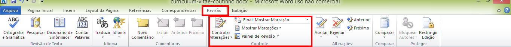
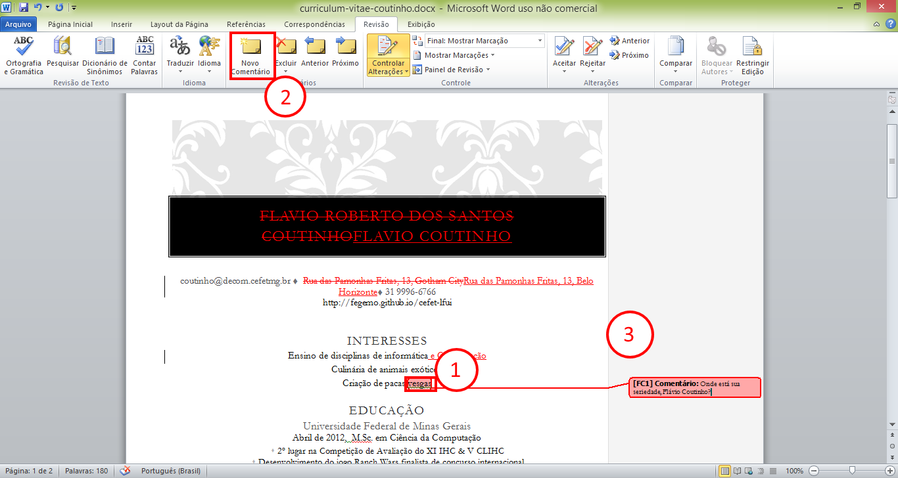

# Informática e Redes de Computadores

- Disciplina: **Laboratório de Fundamentos de Informática**
- Professor: **[Flávio Coutinho](mailto:coutinho@decom.cefetmg.br)**

---
## Guia 20

- Assunto: **Processador de texto**: Word
- Objetivos:
  1. Usar modelos de documento
  1. Praticar formatação de texto, criação de tabela, uso de estilos, inserção
     de figuras, referências e índices
  1. Conhecer e praticar o uso das ferramentas de revisão
  1. Proteger documentos

---
## Roteiro - Exercício

1. Criar seu currículo (35 min)
1. Enviar seu currículo para o colega ao lado e receber o dele (2 min)
1. Fazer alterações para melhorar o currículo do colega (10 min)
1. Receber seu currículo com altlerações (2 min)
1. Aplicar ou rejeitar as alterações (10 min)
1. Proteger o documento contra alterações (5 min)

---
# Entrega: via Moodle até o final **desta aula**

- Entregar, em um arquivo compactado (.zip, .rar, .7z):
  1. Seu currículo inicial (da Parte 1)
  1. O currículo do seu colega revisado (da Parte 3)
  1. O seu currículo após as alterações (da Parte 5)
  1. Seu currículo criptografado e protegido contra alterações (da Parte 6)

- Atenção: como você deve enviar 3 versões diferentes do seu documento (+1 do
  seu colega), você vai precisar criar arquivos diferentes ("Salvar Como")

---
# Parte 1: Criando o currículo

- Você deve criar um novo documento no Word e usar um **modelo de currículo**
- **Preencher o currículo** com suas informações - pessoais, acadêmicas,
  profissionais
- Você **pode** fazer alterações no formato se quiser ter um currículo com uma
  aparência diferente do modelo padrão
- Salvar seu currículo: `curriculum-vitae-parte1.docx`

---
# Parte 2: Enviar seu currículo para o colega ao lado e receber o dele

- Enviar por e-mail

---
# Parte 3: Revisar e criticar o currículo do colega

---
## Ferramentas de revisão

- O Word tem ferramentas para facilitar a revisão por pares (_peer review_) de
  documentos
- Muito útil para casos em que uma pessoa é "dona" e responsável por um
  documento, mas ela quer aceitar sugestões de outra(s) pessoa(s)
  - Exemplo: aluno escrevendo sua monografia e tendo ajuda do professor
    orientador
- A aba **Revisão** dá acesso a esse e a alguns outros recursos no Word

  

---
## Ferramentas de revisão (cont.)

- Para usar
  - Você deve ativar o **controle de alterações**

    

---
## Ferramentas de revisão (cont.)

- **Toda alteração** que você fizer no documento ficará **marcada**. Por
  exemplo:

  

---
## Ferramentas de revisão (cont.)

- Você também pode escrever **comentários** sobre trechos do texto, com
  sugestões de alteração mais complexas ou com explicações sobre suas alterações

  

---
## Ferramentas de revisão (cont.)

- Finda sua revisão, você deve **desativar o controle de alterações**
- Salvar o currículo do colega: `curriculum-vitae-colega-parte3.docx`

---
# Parte 4: Enviar o currículo revisado do colega de volta para ele

- Enviar por e-mail ao colega

---
# Parte 5: Receber seu currículo revisado e aplicar/recusar as sugestões

---
## Aplicando/rejeitando alterações

- Você deve aceitar ou rejeitar todas as alterações realizadas por seu colega
  no seu currículo. Além disso, você também deve ler eventuais comentários que
  ele tenha realizado e optar por fazer mais modificações

  

---
## Aplicando/rejeitando alterações (cont.)

- Após lidar com as alterações
  - Salvar seu currículo: `curriculum-vitae-parte5.docx`

---
# Parte 6: Protegendo documentos

---
## Protegendo documentos

- Você pode criar uma versão "congelada" do seu documento de forma que ela não
  permita alterações
- Também é possível criar uma senha para criptografar o conteúdo do documento

---
## Exercício

- Você deve proteger a última versão do seu currículo contra alterações,
  configurando o arquivo como **versão final**
- Você deve também critpografá-lo usando **os últimos 4 dígitos do seu
  número de matrícula**
- Salvar como: `curriculum-vitae-parte6-XYZW.docx`
  - Em que XYZW são os 4 últimos dígitos da matrícula
