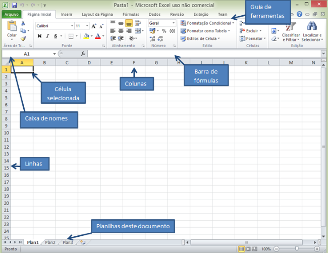
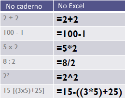

# Informática - REDES

- Disciplina: **Laboratório de Fundamentos de Informática**
- Professor: **[Flávio Coutinho](mailto:coutinho@decom.cefetmg.br)**

---
## Guia **15**

- Assunto: **Planilhas eletrônicas**: Excel
- Objetivos:
  1. Conhecer os conceitos básicos
  1. Praticar formatação básica, preenchimento de células, referências
  1. Praticar o uso de fórmulas simples

---
## Roteiro

1. Conceitos básicos
1. Formatação
1. Fórmulas
1. Exercícios (1 e 2)

---
# Conceitos básicos

---
## O que é o Excel?

- O Excel é o programa de planilha eletrônica do Microsoft Office
  - Você pode fornecer dados (em geral, numéricos) em uma planilha e
    manipulá-los para produzir determinados resultados

- Outras funcionalidades
  - Funções, que podem ser utilizadas para criar fórmulas para executar
    cálculos complexos
  - Geração de gráficos dinâmicos a partir de tabelas
  - Importação e exportação de planilhas em vários formatos, incluindo
    HTML, CSV, PDF, entre outros...

---
## Interface

---
## Conceitos

- **Planilha**: conjunto de células dispostas em **linhas** e **colunas**
- **Célula**: um espaço onde se pode escrever algo
  - É identificada por uma coluna (letra) e uma linha (número)
  - Por exemplo, `A1`, `B1`, `D10`
- Cada documento do excel pode conter várias planilhas (abas)

---
## Seleção de Células

- Célula única
  - Clique com o botão esquerdo do mouse sobre a célula
- 
  Grupo de células contínuas
  1. Clique em uma célula
  1. Pressione e arraste o botão esquerdo do mouse por outras células

---
## Seleção de Células (cont.)

- Grupo de células não-contínuas
  1. Selecione a primeira célula
  1. Pressione e segure a tecla <kbd>Ctrl</kbd>
  1. Clique nas demais células que deseja selecionar

---
## Seleção de linhas e colunas

1. Clique no cabeçalho da primeira linha ou coluna que deseja selecionar
1. Arraste até a última linha ou coluna a contemplar

---
## Seleção de planilha inteira

- Clique entre o cabeçalho das colunas e linhas da planilha

---
## Inserindo linhas e colunas

- Utilizando a guia "Inserir"
  1. Selecione uma célula
  1. Clique em Inserir Linhas na Planilha (ou Colunas)
    
- Utilizando o mouse
  1. Clique com o botão direito do mouse no cabeçalho da coluna ou da linha onde você deseja fazer a inserção
  1. Clique em "Inserir"

---
## Apagando linhas e colunas

1. Selecione a coluna ou a linha que quer apagar
1. Clique com o botão direito no identificador da coluna ou linha
1. Selecione "Excluir" do menu

---
## Preenchimento automático de células

- Preencha a(s) célula(s) com os valores iniciais da sequência
- Selecione a(s) célula(s) preenchida(s)
- Clique na "alça", no canto inferior direito da célula e arraste-o na direção desejada para preencher as demais células automaticamente

---
# Formatação

---
## Formatação

- A formatação é realizada nas células que estiverem selecionadas
- O conjunto de ferramentas de formatação é bastante semelhante àquele que vimos do Word

---
## Formatação (cont.)

---
## Mesclando células

- Mesclar Células (Unir 2 ou mais células)
  1. Selecione as células que deverão ser unidas
  1. Clique no ícone da barra de ferramentas

---
# Fórmulas

---
## Fórmulas simples

- Todas as fórmulas no Calc devem começar com o caractere = (igual), pois é desta maneira que programa entenderá que a entrada é uma fórmula e não um texto.
- Exemplo de Fórmulas

  

---
## Fórmulas: operadores aritméticos

- Operadores Aritméticos
  - \+ Soma
  - \- Subtração
  - \* Multiplicação
  - / Divisão
  - ^ Potenciação
  - % Porcentagem

---
## Somando valores de células

- Somando Valores de Células
  1. Coloque igual (=) na célula que vai receber o cálculo da soma
  1. Selecione o primeiro valor (em uma célula)
  1. Pressione mais (+)
  1. Selecione o segundo valor (em uma célula)
  1. Pressione Enter

- **PS**: Se você deseja somar mais de duas células, repita os passos 2 e 3 (i.e., selecionar os valores e colocando “+” entre eles) e só digite Enter quando todos os valores que você deseja somar estiverem na lista

---
## Copiando fórmula entre células

- Uma fórmula, pode ser copiada para outras células de uma mesma linha ou coluna
- Para isso basta:
  1. Selecionar a célula onde a fórmula foi inserida
  1. Clique na “alça”, no canto inferior direito da célula e arraste-o na direção desejada para preencher as demais células automaticamente
    - **PS:** A fórmula será copiada, entretanto o cálculo será efetuado de acordo com os valores presentes nas células relacionadas

---
# Exercícios

---
## Entrega

- Entrega via **Moodle** até o final **desta aula**
- Você deve entregar **um único arquivo com a extensão `xslx`** contendo as
  duas planilhas que você criar nos exercícios 1 e 2

---
## Exercício **1**

- Crie um arquivo no Excel com o nome `guia15.xslx`
- Deixe apenas a primeira planilha e exclua as outras duas
  
- Construa, na primeira planilha, a tabela abaixo:
  

---
## Exercício **1** (cont.)

- Pede-se:
  1. A coluna Imposto deve ser preenchida da seguinte forma:
     - Se Categoria = 1, imposto é 10%
     - Se Categoria = 2, imposto é 15%
  2. Calcule a coluna Total Produto = somatório das vendas em MG, RJ e SP
     de cada produto. O total produto deve possuir 2 casas decimais e
     separador de milhares.
  3. Calcule a linha Total região = somatório das vendas de cada estado.
     O total região deve possuir 2 casas decimais e separador de milhares.

---
## Exercício **2**

- No **mesmo arquivo**, crie uma nova planilha e construa a tabela abaixo:

  

---
## Exercício **2** (cont.)

- Pede-se:
  1. No fim da Tabela, crie as colunas: Valor Juros e Valor a Pagar
  1. Calcule, para cada linha das colunas criadas:
    1. Valor Juros = (Dias Atr * Perc.Juros) * Valor
    1. Valor a pagar = Valor + Valor Juros
  1. Insira uma linha antes da linha do TOTAL. Escreva média na coluna A
     dessa linha. Na coluna F calcule a média do valor dos juros.
