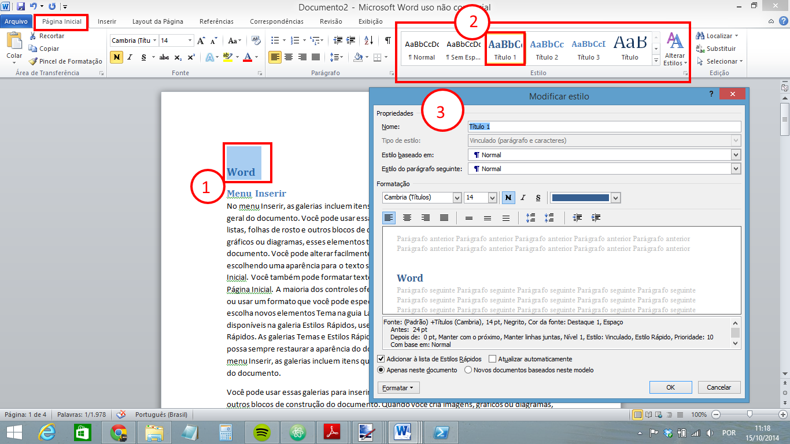
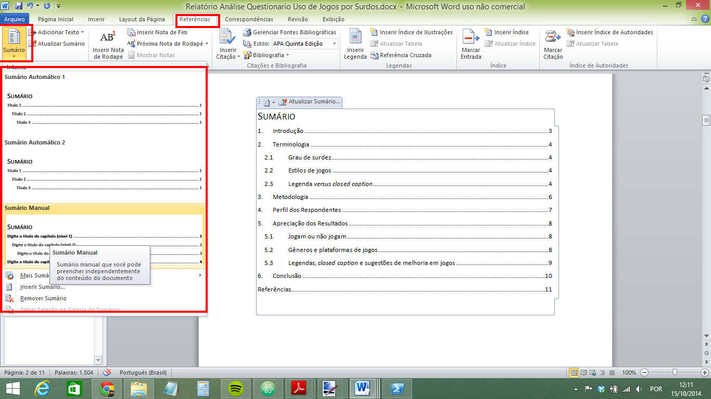
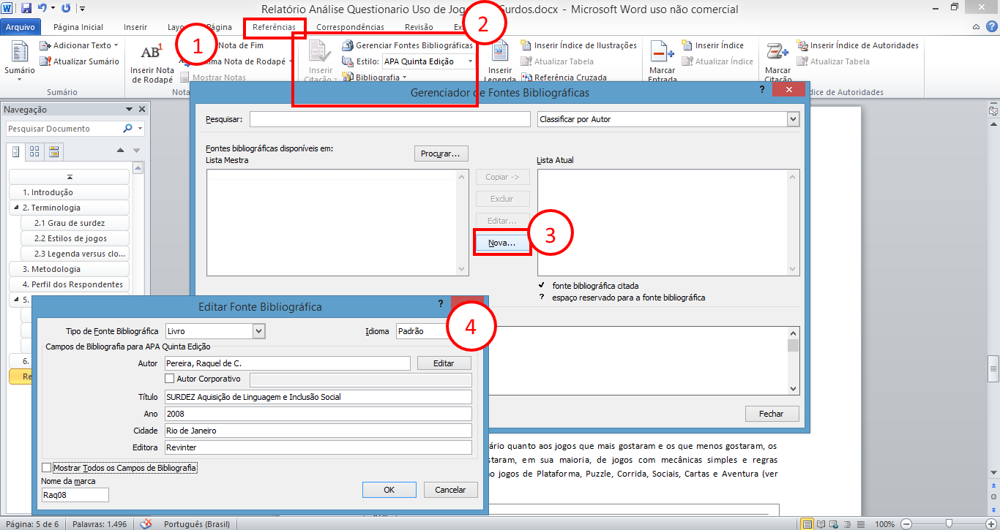
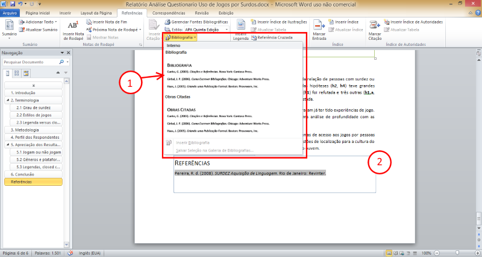
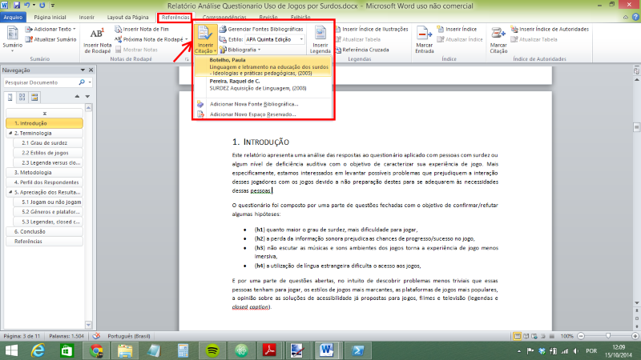
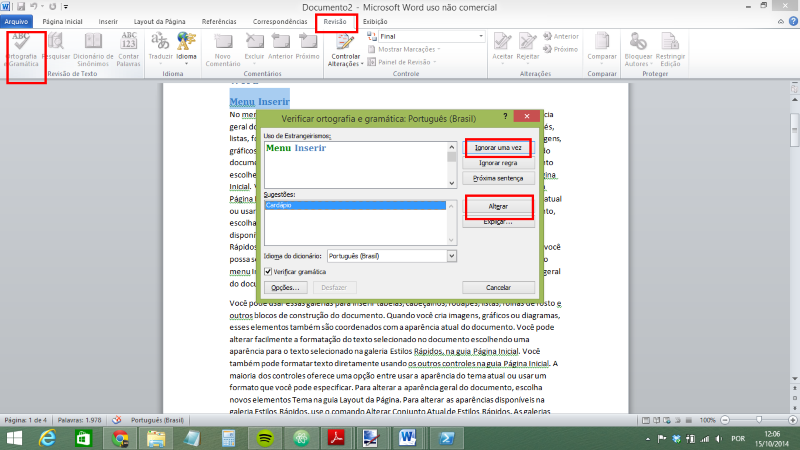

# Informática - REDES

- Disciplina: **Laboratório de Fundamentos de Informática**
- Professor: **[Flávio Coutinho](mailto:coutinho@decom.cefetmg.br)**

---
## Guia 18

- Assunto: **Processador de texto**: Word
- Objetivos:
  1. Criar, editar, carregar e salvar documentos
  1. Praticar formatação de texto, criação de tabela, uso de estilos, inserção
     de figuras, referências e índices
  1. Usar ferramenta de correção ortográfica

---
## Roteiro

1. Criando e carregando documentos (1 min)
1. Formatação do texto e estilos de _design_ (2 min)
1. Criando um sumário (1 min)
1. Adicionando referências e citações (2 min)
1. Revisão de texto (1 min)
1. **Exercício:** Um relatório técnico (60 min)
   <marquee>ENTREGA DE EXERCÍCIO via Moodle</marquee>

---
# Parte 1: Criando e carregando documentos

---
## Menu Arquivo

---
## Menu Arquivo &gt; Opção **Novo** (cont.)

- Você pode criar um documento em branco
- Mas também pode usar um **modelo** pronto de algum tipo de documento, por
  exemplo:
  - Uma lista de presença
  - Um currículo
  - Um certificado
  - Um cartão de visita

---
## Menu Arquivo &gt; Opções **Salvar** e **Salvar como...**

- A primeira vez que se clica em **Salvar** para um documento novo, você deve
  escolher em que pasta e qual o nome do arquivo deseja persistí-lo
- Próximos cliques em **Salvar** não requerem nenhum tipo de escolha
- Para criar uma cópia do arquivo atual, use a opção **Salvar Como...** para
  escolher um local e um nome para a cópia

---
## Menu Arquivo &gt; Opção **Abrir**

- Para carregar um arquivo, você pode acessar a opção **Abrir** e selecionar o
  documento do sistema de arquivos (pasta e nome do arquivo)

## Menu Arquivo &gt; Opção **Informações**

- Possibilita a configuração de proteção do documento
  - Você pode criptografá-lo e apenas quem tiver uma senha pode abrí-lo
  - Você pode impedir que modificações sejam feitas ao documento
  - Você pode associar uma assinatura digital

---
# Parte 2: Formatação do texto e estilos de _design_

---
## Duas formas para formatar texto

- Você pode alterar a fonte, uso de negrito, itálico, sublinhado, tachado,
  tamanho, espaçamento, bordas e várias outras coisas de duas formas
  - Específica
    - Alteramos a formatação dos elementos que estão selecionados
    - Ideal para textos pequenos
  - Com estilos
    - Alteramos a formatação de "partes" da página como: parágrafos, títulos,
      subtítulos etc.
    - Ideal para textos maiores, mais técnicos ou científicos
- Veja exemplos dos dois _slides_ seguintes

---
## Formatação **específica**

---
## Formatação **por estilos**

---
## Formatação **por estilos** (cont.)

- Com a formatação por estilos, além de ter a facilidade de alterar várias
  partes do documento de uma vez, também **estamos dizendo ao Word: isto aqui é
  um título, isto aqui um subtítulo, isto aqui é corpo do texto etc.**
- Dessa forma, conseguimos, por exemplo, gerar um **sumário automaticamente** e
  com o número das páginas preenchido dinamicamente

---
# Parte 3:  Criando um sumário

---
## Sumário

- Uma vez que você marcou quais são seus títulos e subtítulos, você pode gerar
  o sumário automaticamente

  

---
# Parte 4: Adicionando referências e citações

---
## Preenchendo suas **fontes bibliográficas** (pt 1)

---
## Criando uma **Bibliografia** (pt 2)

---
## **Citando** no texto

---
# Parte 5: Revisão de texto

---
## Revisão ortográfica e gramatical

---
# Parte 6: Um Relatório Técnico (Exercício)

- Entrega **até o final desta aula** via Moodle
- Você deve entregar o seu documento em formato .docx

---
## Exercício

  Você deve criar um texto científico com o conteúdo e formatação idênticos a
  [este relatório técnico](https://drive.google.com/file/d/0B6-KCjtlxaKIS3F1VDM4MnV6cjQ/view?usp=sharing). A imagem a ser utilizada
  é [esta aqui](images/word-grafico.png).

---
## Exercício (cont.)

1. O documento deve usar a fonte Calibri (corpo) tamanho 10, com parágrafos
   justificados
1. Algumas listas possuem mais de uma coluna
1. Palavras em negrito, itálico, etc. devem ser idênticas às do documento de
   referência
1. A capa deve ser semelhante à do documento de referência, mas não precisa ser
   idêntica. Ela deve conter seu nome completos
1. As páginas devem conter numeração no seu rodapé, do lado direito

---
## Exercício (cont.)

1. O **sumário** deve ser criado **automaticamente**
   - Portanto, utilize os **estilos de títulos** para criar os títulos das seções
1. Você deve incluir a figura do gráfico referenciá-la com uma **referência
   cruzada**
1. A tabela deve possuir uma legenda (Tabela 1: Tabela com as sugestões...) e
   ela deve ser referenciada por uma **referência cruzada** também
   - Use **estilos de _Design_** para colorir a tabela

---
## Exercício (cont.)

1. A seção de **referências** deve ser criada **automaticamente**
   - Portanto, utilize as ferramentas de bibliografia ao fazer as citações no
    texto
1. O documento de referência possui erros de escrita (ortografia e gramática).
   Você deve **encontrar e corrigir todos os erros**
