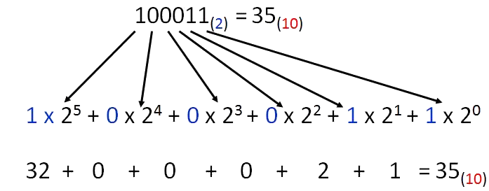

# Informática

- Disciplina: **Laboratório de Fundamentos de Informática**
- Professor: **[Flávio Coutinho](mailto:coutinho@decom.cefetmg.br)**

---
## Guia 5

- Assunto: Sistemas de numeração
- Objetivos:
  1. Conhecer diferentes sistemas de base numérica
  1. Praticar a conversão de números entre bases 
  1. Entender a representação usada pelo computador na tabela ASCII

---
## Roteiro

1. Bits e bytes
1. Sistema de numeração
1. Codificação
1. Exercício

---
# Bits e bytes

- Assim como pessoas, computadores também precisam saber contar
  - Pessoas costumam usar seus dedos da mão para contar
    - Isso não é possível para computadores, mas eles sabem identificar "presença/ausência" de energia
- Ao usar 0/1 (**um bit**) para representar números, os computadores conseguiriam contar apenas até 1
  - Contudo, usando mais de um dígito, **aumenta-se o número total que ele consegue contar**
  - Usando-se 2 dígitos, temos estas possibilidades:
    - 00, 01, 10, 11
  - Representando os números
    - 0, 1, 2, 3

---
## Agrupamento de bits

- Cada novo dígito que usarmos, nos permite contar o dobro de números que podíamos contar sem esse dígito.
  - Exemplo: 
    - 2 dígitos, contamos 4 números (0 a 3)
    - 3 dígitos, contamos 8 números (0 a 7)
    - 4 dígitos, contamos 16 números (0 a 15)
- Se agruparmos 8 dígitos, quantos números conseguimos contar?

---
## Bytes

- Podemos determinar quantos números são "contáveis" usando uma fórmula:
  - `numeros = 2^d`, sendo `d`o número de dígitos
- Assim, podemos ver que, com **8 dígitos, contamos 256 números** (0 a 255)
- A esse agrupamento de **8 bits** foi dado o nome de **byte**

---
# Sistema de numeração

- Podemos converter um número que está representado na base **binária para decimal**
- Digamos que queremos converter 1000112 para decimal:
  
  

---
# Codificação

- Agora sabemos que os processadores só conhecem números, e no formato binário apenas
- Contudo, se tivéssemos apenas números os processadores seriam apenas calculadoras
  - Pergunta: como podemos representar letras para alguém que só sabe lidar com números?
    - Podemos **associar um número a cada letra** que queremos representar
    - Se consideramos um alfabeto de 26 letras, **quantos bits precisamos** para representar todas elas?
      - 1? 2? 3? 4? 5?

---
# Codificação

- Com 5 bits, conseguimos representar do número 0 ao 31 (que é suficiente)
  - Contudo, além do alfabeto, temos também números, pontuações e letras acentuadas
- Uma associação de normas norte-americana considerou que **8 bits seriam suficientes** (0 a 255) 
  para representar todos os caracteres possíveis em um texto
- A **American Standards Association** criou a tabela <abbr title="American Standard Code for Information Interchange">ASCII</abbr>, 
  que associa um número para cada caractere que pode ser encontrado em um texto
  - Veja a tabela nos próximos 5 _slides_
  
---
## Tabela ASCII

<table>
    <tr>
        <th>Decimal</th>
        <th>Binário</th>
        <th>Caractere</th>
        <th>Decimal</th>
        <th>Binário</th>
        <th>Caractere</th>
        <th>Decimal</th>
        <th>Binário</th>
        <th>Caractere</th>
    </tr>
    <tr>
        <td>32</td>
        <td></td>
        <td>(espaço)</td>
        <td>33</td>
        <td></td>
        <td>!</td>
        <td>34</td>
        <td></td>
        <td>"</td>
    </tr>
    <tr>
        <td>35</td>
        <td></td>
        <td>#</td>
        <td>36</td>
        <td></td>
        <td>$</td>
        <td>37</td>
        <td></td>
        <td>%</td>
    </tr>
    <tr>
        <td>38</td>
        <td></td>
        <td>&</td>
        <td>39</td>
        <td></td>
        <td>'</td>
        <td>40</td>
        <td></td>
        <td>(</td>
    </tr>
    <tr>
        <td>41</td>
        <td></td>
        <td>)</td>
        <td>42</td>
        <td></td>
        <td>*</td>
        <td>43</td>
        <td></td>
        <td>+</td>
    </tr>
    <tr>
        <td>44</td>
        <td></td>
        <td>,</td>
        <td>45</td>
        <td></td>
        <td>-</td>
        <td>46</td>
        <td></td>
        <td>.</td>
    </tr>
    <tr>
        <td>47</td>
        <td></td>
        <td>/</td>
        <td>48</td>
        <td></td>
        <td>0</td>
        <td>49</td>
        <td></td>
        <td>1</td>
    </tr>
    <tr>
        <td>50</td>
        <td></td>
        <td>2</td>
        <td>51</td>
        <td></td>
        <td>3</td>
        <td>52</td>
        <td></td>
        <td>4</td>
    </tr>
    <tr>
        <td>53</td>
        <td></td>
        <td>5</td>
        <td>54</td>
        <td></td>
        <td>6</td>
        <td>55</td>
        <td></td>
        <td>7</td>
    </tr>
    <tr>
        <td>56</td>
        <td></td>
        <td>8</td>
        <td>57</td>
        <td></td>
        <td>9</td>
        <td>58</td>
        <td></td>
        <td>:</td>
    </tr>
    <tr>
        <td>59</td>
        <td></td>
        <td>;</td>
        <td>60</td>
        <td></td>
        <td>
            <</td>
                <td>61</td>
                <td></td>
                <td>=</td>
    </tr>
    <tr>
        <td>62</td>
        <td></td>
        <td>></td>
        <td>63</td>
        <td></td>
        <td>?</td>
        <td>64</td>
        <td></td>
        <td>@</td>
    </tr>
    <tr>
        <td>65</td>
        <td></td>
        <td>A</td>
        <td>66</td>
        <td></td>
        <td>B</td>
        <td>67</td>
        <td></td>
        <td>C</td>
    </tr>
    <tr>
        <td>68</td>
        <td></td>
        <td>D</td>
        <td>69</td>
        <td></td>
        <td>E</td>
        <td>70</td>
        <td></td>
        <td>F</td>
    </tr>
    <tr>
        <td>71</td>
        <td></td>
        <td>G</td>
        <td>72</td>
        <td></td>
        <td>H</td>
        <td>73</td>
        <td></td>
        <td>I</td>
    </tr>
    <tr>
        <td>74</td>
        <td></td>
        <td>J</td>
        <td>75</td>
        <td></td>
        <td>K</td>
        <td>76</td>
        <td></td>
        <td>L</td>
    </tr>
    <tr>
        <td>77</td>
        <td></td>
        <td>M</td>
        <td>78</td>
        <td></td>
        <td>N</td>
        <td>79</td>
        <td></td>
        <td>O</td>
    </tr>
</table>

---
## Tabela ASCII (página 2)

<table>
    <tr>
        <th>Decimal</th>
        <th>Binário</th>
        <th>Caractere</th>
        <th>Decimal</th>
        <th>Binário</th>
        <th>Caractere</th>
        <th>Decimal</th>
        <th>Binário</th>
        <th>Caractere</th>
    </tr>
    <tr>
        <td>80</td>
        <td></td>
        <td>P</td>
        <td>81</td>
        <td></td>
        <td>Q</td>
        <td>82</td>
        <td></td>
        <td>R</td>
    </tr>
    <tr>
        <td>83</td>
        <td></td>
        <td>S</td>
        <td>84</td>
        <td></td>
        <td>T</td>
        <td>85</td>
        <td></td>
        <td>U</td>
    </tr>
    <tr>
        <td>86</td>
        <td></td>
        <td>V</td>
        <td>87</td>
        <td></td>
        <td>W</td>
        <td>88</td>
        <td></td>
        <td>X</td>
    </tr>
    <tr>
        <td>89</td>
        <td></td>
        <td>Y</td>
        <td>90</td>
        <td></td>
        <td>Z</td>
        <td>91</td>
        <td></td>
        <td>[</td>
    </tr>
    <tr>
        <td>92</td>
        <td></td>
        <td>\</td>
        <td>93</td>
        <td></td>
        <td>]</td>
        <td>94</td>
        <td></td>
        <td>^</td>
    </tr>
    <tr>
        <td>95</td>
        <td></td>
        <td>_</td>
        <td>96</td>
        <td></td>
        <td>`</td>
        <td>97</td>
        <td></td>
        <td>a</td>
    </tr>
    <tr>
        <td>98</td>
        <td></td>
        <td>b</td>
        <td>99</td>
        <td></td>
        <td>c</td>
        <td>100</td>
        <td></td>
        <td>d</td>
    </tr>
    <tr>
        <td>101</td>
        <td></td>
        <td>e</td>
        <td>102</td>
        <td></td>
        <td>f</td>
        <td>103</td>
        <td></td>
        <td>g</td>
    </tr>
    <tr>
        <td>104</td>
        <td></td>
        <td>h</td>
        <td>105</td>
        <td></td>
        <td>i</td>
        <td>106</td>
        <td></td>
        <td>j</td>
    </tr>
    <tr>
        <td>107</td>
        <td></td>
        <td>k</td>
        <td>108</td>
        <td></td>
        <td>l</td>
        <td>109</td>
        <td></td>
        <td>m</td>
    </tr>
    <tr>
        <td>110</td>
        <td></td>
        <td>n</td>
        <td>111</td>
        <td></td>
        <td>o</td>
        <td>112</td>
        <td></td>
        <td>p</td>
    </tr>
    <tr>
        <td>113</td>
        <td></td>
        <td>q</td>
        <td>114</td>
        <td></td>
        <td>r</td>
        <td>115</td>
        <td></td>
        <td>s</td>
    </tr>
    <tr>
        <td>116</td>
        <td></td>
        <td>t</td>
        <td>117</td>
        <td></td>
        <td>u</td>
        <td>118</td>
        <td></td>
        <td>v</td>
    </tr>
    <tr>
        <td>119</td>
        <td></td>
        <td>w</td>
        <td>120</td>
        <td></td>
        <td>x</td>
        <td>121</td>
        <td></td>
        <td>y</td>
    </tr>
    <tr>
        <td>122</td>
        <td></td>
        <td>z</td>
        <td>123</td>
        <td></td>
        <td>{</td>
        <td>124</td>
        <td></td>
        <td>|</td>
    </tr>
    <tr>
        <td>125</td>
        <td></td>
        <td>}</td>
        <td>126</td>
        <td></td>
        <td>~</td>
        <td>127</td>
        <td></td>
        <td></td>
    </tr>
</table>
    
---
## Tabela ASCII (página 3)

<table>
    <tr>
        <th>Decimal</th>
        <th>Binário</th>
        <th>Caractere</th>
        <th>Decimal</th>
        <th>Binário</th>
        <th>Caractere</th>
        <th>Decimal</th>
        <th>Binário</th>
        <th>Caractere</th>
    </tr>
    <tr>
        <td>128</td>
        <td></td>
        <td>€</td>
        <td>129</td>
        <td></td>
        <td></td>
        <td>130</td>
        <td></td>
        <td>‚</td>
    </tr>
    <tr>
        <td>131</td>
        <td></td>
        <td>ƒ</td>
        <td>132</td>
        <td></td>
        <td>„</td>
        <td>133</td>
        <td></td>
        <td>…</td>
    </tr>
    <tr>
        <td>134</td>
        <td></td>
        <td>†</td>
        <td>135</td>
        <td></td>
        <td>‡</td>
        <td>136</td>
        <td></td>
        <td>ˆ</td>
    </tr>
    <tr>
        <td>137</td>
        <td></td>
        <td>‰</td>
        <td>138</td>
        <td></td>
        <td>Š</td>
        <td>139</td>
        <td></td>
        <td>‹</td>
    </tr>
    <tr>
        <td>140</td>
        <td></td>
        <td>Œ</td>
        <td>141</td>
        <td></td>
        <td></td>
        <td>142</td>
        <td></td>
        <td>Ž</td>
    </tr>
    <tr>
        <td>143</td>
        <td></td>
        <td></td>
        <td>144</td>
        <td></td>
        <td></td>
        <td>145</td>
        <td></td>
        <td>‘</td>
    </tr>
    <tr>
        <td>146</td>
        <td></td>
        <td>’</td>
        <td>147</td>
        <td></td>
        <td>“</td>
        <td>148</td>
        <td></td>
        <td>”</td>
    </tr>
    <tr>
        <td>149</td>
        <td></td>
        <td>•</td>
        <td>150</td>
        <td></td>
        <td>–</td>
        <td>151</td>
        <td></td>
        <td>—</td>
    </tr>
    <tr>
        <td>152</td>
        <td></td>
        <td>˜</td>
        <td>153</td>
        <td></td>
        <td>™</td>
        <td>154</td>
        <td></td>
        <td>š</td>
    </tr>
    <tr>
        <td>155</td>
        <td></td>
        <td>›</td>
        <td>156</td>
        <td></td>
        <td>œ</td>
        <td>157</td>
        <td></td>
        <td></td>
    </tr>
    <tr>
        <td>158</td>
        <td></td>
        <td>ž</td>
        <td>159</td>
        <td></td>
        <td>Ÿ</td>
        <td>160</td>
        <td></td>
        <td> </td>
    </tr>
    <tr>
        <td>161</td>
        <td></td>
        <td>¡</td>
        <td>162</td>
        <td></td>
        <td>¢</td>
        <td>163</td>
        <td></td>
        <td>£</td>
    </tr>
    <tr>
        <td>164</td>
        <td></td>
        <td>¤</td>
        <td>165</td>
        <td></td>
        <td>¥</td>
        <td>166</td>
        <td></td>
        <td>¦</td>
    </tr>
    <tr>
        <td>167</td>
        <td></td>
        <td>§</td>
        <td>168</td>
        <td></td>
        <td>¨</td>
        <td>169</td>
        <td></td>
        <td>©</td>
    </tr>
    <tr>
        <td>170</td>
        <td></td>
        <td>ª</td>
        <td>171</td>
        <td></td>
        <td>«</td>
        <td>172</td>
        <td></td>
        <td>¬</td>
    </tr>
    <tr>
        <td>173</td>
        <td></td>
        <td>­</td>
        <td>174</td>
        <td></td>
        <td>®</td>
        <td>175</td>
        <td></td>
        <td>¯</td>
    </tr>
</table>

---
## Tabela ASCII (página 4)

<table>
    <tr>
        <th>Decimal</th>
        <th>Binário</th>
        <th>Caractere</th>
        <th>Decimal</th>
        <th>Binário</th>
        <th>Caractere</th>
        <th>Decimal</th>
        <th>Binário</th>
        <th>Caractere</th>
    </tr>
    <tr>
        <td>176</td>
        <td></td>
        <td>°</td>
        <td>177</td>
        <td></td>
        <td>±</td>
        <td>178</td>
        <td></td>
        <td>²</td>
    </tr>
    <tr>
        <td>179</td>
        <td></td>
        <td>³</td>
        <td>180</td>
        <td></td>
        <td>´</td>
        <td>181</td>
        <td></td>
        <td>µ</td>
    </tr>
    <tr>
        <td>182</td>
        <td></td>
        <td>¶</td>
        <td>183</td>
        <td></td>
        <td>·</td>
        <td>184</td>
        <td></td>
        <td>¸</td>
    </tr>
    <tr>
        <td>185</td>
        <td></td>
        <td>¹</td>
        <td>186</td>
        <td></td>
        <td>º</td>
        <td>187</td>
        <td></td>
        <td>»</td>
    </tr>
    <tr>
        <td>188</td>
        <td></td>
        <td>¼</td>
        <td>189</td>
        <td></td>
        <td>½</td>
        <td>190</td>
        <td></td>
        <td>¾</td>
    </tr>
    <tr>
        <td>191</td>
        <td></td>
        <td>¿</td>
        <td>192</td>
        <td></td>
        <td>À</td>
        <td>193</td>
        <td></td>
        <td>Á</td>
    </tr>
    <tr>
        <td>194</td>
        <td></td>
        <td>Â</td>
        <td>195</td>
        <td></td>
        <td>Ã</td>
        <td>196</td>
        <td></td>
        <td>Ä</td>
    </tr>
    <tr>
        <td>197</td>
        <td></td>
        <td>Å</td>
        <td>198</td>
        <td></td>
        <td>Æ</td>
        <td>199</td>
        <td></td>
        <td>Ç</td>
    </tr>
    <tr>
        <td>200</td>
        <td></td>
        <td>È</td>
        <td>201</td>
        <td></td>
        <td>É</td>
        <td>202</td>
        <td></td>
        <td>Ê</td>
    </tr>
    <tr>
        <td>203</td>
        <td></td>
        <td>Ë</td>
        <td>204</td>
        <td></td>
        <td>Ì</td>
        <td>205</td>
        <td></td>
        <td>Í</td>
    </tr>
    <tr>
        <td>206</td>
        <td></td>
        <td>Î</td>
        <td>207</td>
        <td></td>
        <td>Ï</td>
        <td>208</td>
        <td></td>
        <td>Ð</td>
    </tr>
    <tr>
        <td>209</td>
        <td></td>
        <td>Ñ</td>
        <td>210</td>
        <td></td>
        <td>Ò</td>
        <td>211</td>
        <td></td>
        <td>Ó</td>
    </tr>
    <tr>
        <td>212</td>
        <td></td>
        <td>Ô</td>
        <td>213</td>
        <td></td>
        <td>Õ</td>
        <td>214</td>
        <td></td>
        <td>Ö</td>
    </tr>
    <tr>
        <td>215</td>
        <td></td>
        <td>×</td>
        <td>216</td>
        <td></td>
        <td>Ø</td>
        <td>217</td>
        <td></td>
        <td>Ù</td>
    </tr>
    <tr>
        <td>218</td>
        <td></td>
        <td>Ú</td>
        <td>219</td>
        <td></td>
        <td>Û</td>
        <td>220</td>
        <td></td>
        <td>Ü</td>
    </tr>
    <tr>
        <td>221</td>
        <td></td>
        <td>Ý</td>
        <td>222</td>
        <td></td>
        <td>Þ</td>
        <td>223</td>
        <td></td>
        <td>ß</td>
    </tr>
</table>

---
## Tabela ASCII (página 5)

<table>
    <tr>
        <th>Decimal</th>
        <th>Binário</th>
        <th>Caractere</th>
        <th>Decimal</th>
        <th>Binário</th>
        <th>Caractere</th>
        <th>Decimal</th>
        <th>Binário</th>
        <th>Caractere</th>
    </tr>
    <tr>
        <td>224</td>
        <td></td>
        <td>à</td>
        <td>225</td>
        <td></td>
        <td>á</td>
        <td>226</td>
        <td></td>
        <td>â</td>
    </tr>
    <tr>
        <td>227</td>
        <td></td>
        <td>ã</td>
        <td>228</td>
        <td></td>
        <td>ä</td>
        <td>229</td>
        <td></td>
        <td>å</td>
    </tr>
    <tr>
        <td>230</td>
        <td></td>
        <td>æ</td>
        <td>231</td>
        <td></td>
        <td>ç</td>
        <td>232</td>
        <td></td>
        <td>è</td>
    </tr>
    <tr>
        <td>233</td>
        <td></td>
        <td>é</td>
        <td>234</td>
        <td></td>
        <td>ê</td>
        <td>235</td>
        <td></td>
        <td>ë</td>
    </tr>
    <tr>
        <td>236</td>
        <td></td>
        <td>ì</td>
        <td>237</td>
        <td></td>
        <td>í</td>
        <td>238</td>
        <td></td>
        <td>î</td>
    </tr>
    <tr>
        <td>239</td>
        <td></td>
        <td>ï</td>
        <td>240</td>
        <td></td>
        <td>ð</td>
        <td>241</td>
        <td></td>
        <td>ñ</td>
    </tr>
    <tr>
        <td>242</td>
        <td></td>
        <td>ò</td>
        <td>243</td>
        <td></td>
        <td>ó</td>
        <td>244</td>
        <td></td>
        <td>ô</td>
    </tr>
    <tr>
        <td>245</td>
        <td></td>
        <td>õ</td>
        <td>246</td>
        <td></td>
        <td>ö</td>
        <td>247</td>
        <td></td>
        <td>÷</td>
    </tr>
    <tr>
        <td>248</td>
        <td></td>
        <td>ø</td>
        <td>249</td>
        <td></td>
        <td>ù</td>
        <td>250</td>
        <td></td>
        <td>ú</td>
    </tr>
    <tr>
        <td>251</td>
        <td></td>
        <td>û</td>
        <td>252</td>
        <td></td>
        <td>ü</td>
        <td>253</td>
        <td></td>
        <td>ý</td>
    </tr>
    <tr>
        <td>254</td>
        <td></td>
        <td>þ</td>
        <td>255</td>
        <td></td>
        <td>ÿ</td>
        <td>256</td>
        <td></td>
        <td>Ā</td>
    </tr>
</table>

---
# Exercício

- A sala será dividida em 2 grupos
- Cada grupo deve **descobrir uma frase que está codificada em números binários usando a tabela ASCII**
- Passos:
  1. Pergunte ao professor qual será sua frase
  1. O professor distribuirá uma frase para cada grupo
  1. O grupo terá até o final da aula para decodificar a frase completamente
  1. O resultado deve ser postado no Moodle
  1. Quem **terminar primeiro, ganhará 20% extra** na atividade
  
---
## Frase (1)

<code class="texto-binario" style="display: none">
1001000 1101111 1101101 1100101 1101101 100000 1110001 1110101 1100101 100000 1100110 1101001 1100011 1101111 1110101 100000 110001 111000 100000 1101000 1101111 1110010 1100001 1110011 100000 1101110 1100001 100000 1100110 1101001 1101100 1100001 100000 1100100 1100001 100000 1000001 1110000 1110000 1101100 1100101 100000 1110000 1100101 1110010 1100111 1110101 1101110 1110100 1101111 1110101 100000 1110011 1100101 100000 1110100 1101001 1101110 1101000 1100001 100000 1000111 1100001 1101100 1100001 1111000 1111001 
</code>

---
## Frase (2)

<code class="texto-binario" style="display: none">
1010000 1100101 1110011 1110001 1110101 1101001 1110011 1100001 1100100 1101111 1110010 100000 1100001 1110000 1110010 1101111 1100110 1110101 1101110 1100100 1100001 100000 1110010 1100101 1110110 1101111 1101100 1110101 11100111 11100011 1101111 100000 1101110 1101111 100000 1100011 1101001 1101110 1100101 1101101 1100001 100000 110011 1000100 100000 1100101 100000 1101001 1101110 1110110 1100101 1101110 1110100 1100001 100000 1101111 100000 1110100 1100101 1100001 1110100 1110010 1101111 
</code>

---
## Frase (3)

<code class="texto-binario" style="display: none">
1010000 1110101 1111000 1100001 1110010 100000 1110000 1100001 1110000 1101111 100000 1100011 1101111 1101101 100000 1100001 1110100 1100101 1101110 1100100 1100101 1101110 1110100 1100101 100000 1100100 1100101 100000 1110100 1100101 1101100 1100101 1101101 1100001 1110010 1101011 1100101 1110100 1101001 1101110 1100111 100000 11101001 100000 1110011 1101001 1101110 1100001 1101100 100000 1100100 1100101 100000 1100100 1100101 1110000 1110010 1100101 1110011 1110011 11100011 1101111 100000 1110000 1110010 1101111 1100110 1110101 1101110 1100100 1100001 101100 100000 1100100 1101001 1111010 100000 1110000 1110011 1101001 1100011 11110011 1101100 1101111 1100111 1101111
</code>

---
## Frase (4)

<code class="texto-binario" style="display: none">
1000001 11101001 1100011 1101001 1101111 100000 1101110 11100011 1101111 100000 1100110 1101111 1101001 100000 11100000 1110011 100000 1101101 1100001 1101110 1101001 1100110 1100101 1110011 1110100 1100001 11100111 11110101 1100101 1110011 100000 1100100 1100101 100000 1100100 1101111 1101101 1101001 1101110 1100111 1101111 111010 100000 100010 1110100 1100101 1110010 1100011 1100101 1101001 1110010 1101001 1111010 1100101 1101001 100010 
</code>

---
## Frase (5)

<code class="texto-binario" style="display: none">
1001110 1101111 1110110 1101111 100000 1110100 1100101 1110011 1110100 1100101 100000 1100100 1100101 100000 1100010 1100001 1101100 1101001 1111010 1100001 100000 1100100 1101111 100000 1000100 1100101 1110100 1110010 1100001 1101110 100000 1101001 1101110 1100011 1101100 1110101 1101001 100000 1100100 1101001 1110010 1101001 1100111 1101001 1110010 100000 1100100 1101001 1100111 1101001 1110100 1100001 1101110 1100100 1101111 100000 1101110 1101111 100000 1010111 1101000 1100001 1110100 1110011 1100001 1110000 1110000
</code>

---
## Frase (6)

<code class="texto-binario" style="display: none">
1001111 1110000 1100101 1110010 1100001 1100100 1101111 1110010 1100001 1110011 100000 1100100 1100101 100000 1100011 1100101 1101100 1110101 1101100 1100001 1110010 100000 1110011 1100101 1110010 11100011 1101111 100000 1101111 1100010 1110010 1101001 1100111 1100001 1100100 1100001 1110011 100000 1100001 100000 1100110 1101111 1110010 1101110 1100101 1100011 1100101 1110010 100000 1110011 1101001 1101110 1100001 1101100 
</code>

---
## Frase (7)

<code class="texto-binario" style="display: none">
1001000 1101111 1101101 1100101 1101101 100000 1110110 1100101 1101110 1100100 1100101 100000 1010101 1010011 100100 100000 110001 100000 1110001 1110101 1100101 100000 1100011 1101111 1101101 1110000 1110010 1101111 1110101 100000 1101110 1101111 100000 1101001 1101110 11101101 1100011 1101001 1101111 100000 1100100 1101111 100000 1100111 1101111 1110110 1100101 1110010 1101110 1101111 100000 1000100 1101001 1101100 1101101 1100001 100000 1100101 100000 1110011 1100101 100000 1100001 1110000 1101111 1110011 1100101 1101110 1110100 1100001
</code>

