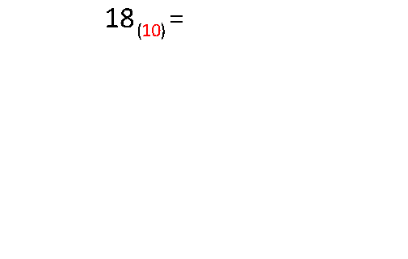

# Informática

- Disciplina: **Laboratório de Fundamentos de Informática**
- Professor: **[Flávio Coutinho](mailto:coutinho@decom.cefetmg.br)**

---
## Guia 6

- Assunto: Sistemas de numeração
- Objetivos:
  1. Praticar a conversão de números entre bases 
  1. Praticar aritmética binária
  

---
## Roteiro

1. Bases comuns na computação
1. Exercício 1
1. Conversões **para** a base decimal
1. Conversões **a partir** da base decimal
1. Exercício 2

---
# Bases comuns na computação

---
## Bases comuns na computação

- Vimos que o computador consegue representar dígitos binários (ou bits), que podem possuir valor 0 ou 1 apenas
  - Isso faz com que ele precise usar o **sistema de numeração binário**
- Contudo, outras bases de numeração também são úteis na computação:
  1. Base decimal (10)
  1. **Base hexadecimal (16)**
  1. **Base octal (8)**

---
## Base **hexadecimal**

- Seus algarismos são 0, 1, 2, 3, 4, 5, 6, 7, 8, 9, **A, B, C, D, E, F**
- Como não temos algarismos únicos para representar os números 10 a 15, usamos as letras A - F, sendo que:
  - A = 10
  - B = 11
  - ...
  - F = 15
- Exemplos:
 - 20AC<sub>16</sub> = 8364<sub>10</sub>
 - FFFF<sub>16</sub> = 65535<sub>10</sub>
 - 11<sub>16</sub> = 17<sub>10</sub>
 
---
## Base **octal**

- Seus algarismos são 0, 1, 2, 3, 4, 5, 6, 7
- Exemplos:
 - 71<sub>8</sub> = 57<sub>10</sub>
 - 112<sub>8</sub> = 74<sub>10</sub>
 - 560<sub>8</sub> = 368<sub>10</sub>

---
# Exercício 1

---
## Exercício 1

1. Baixe o código fonte do programa `descbin.c` disponibilizado no Moodle
  - Esse programa lê um arquivo e o imprime na tela de dois jeitos:
    1. Binário ou hexadecimal (parte da esquerda)
    1. Textual, usando a tabela ASCII (parte da direita)
  - 
    Veja um exemplo:
  - Para executar, você deve passar alguns **argumentos em linha de comando** para o programa. Por exemplo:
    ```
    C:\> descbin.exe b arquivo.txt
    ```
    
---
## Exercício 1 (cont.)

1. Compile e execute o programa e o utilize para ler 2 arquivos:
  - Um arquivo de texto (por exemplo, um arquivo musica.txt)
  - Um arquivo não textual (por exemplo, um foto, um pdf, um docx)
1. Você deve entregar, no Moodle, **4 _screenshots_ da saída do programa**, sendo elas para:
  - o arquivo binário, no formato binário
  - o arquivo binário, no formato hexadecimal
  - o arquivo textual, no formato binário
  - o arquivo textual, no formato hexadecimal
 
---
# Conversões **para** a base decimal

---
## **Binário** para decimal

- Para converter um número na base binária para a base decimal, 
  deve-se fazer uma soma de cada dígito multiplicado por 2<sup>n</sup>, 
  em que n é o índice do dígito da direita para a esquerda (começando por 0):
  - Exemplo:

    

  
---
## **Hexadecimal** para decimal

- A conversão de um número na base hexadecimal segue processo idêntico ao de números binários
  - Contudo, a base é 16 em vez de 2
- Exemplo:

  
  
---
## **Octal** para decimal

- A conversão de um número na base octal também segue processo idêntico ao de números binários
  - Contudo, a base é 8 em vez de 2
- Exemplo:

  

---
# Conversões **a partir** da base decimal

---
## Decimal para **binário**

- Para converter um número decimal para binário, devemos fazer consecutivas divisões por 2 
  até que o quociente seja 1
  - O número binário será a _concatenação_ do último quociente (1) com os restos das divisões 
    anteriores, na ordem inversa com que apareceram
- 
  Exemplo:
  

---
## Decimal para **hexadecimal** ou **octal**

- A conversão de decimal para hexadecimal, octal ou qualquer outra base segue o mesmo procedimento 
  da conversão para binário
  - Contudo o divisor será 16, 8 ou o número de outra base
  - Para-se de dividir quando o quociente fica menor que o divisor
- 
  Exemplo:


---
# Exercício 2

- Faça as seguintes conversões e poste seus resultados no Moodle:
  <ol class="multi-column-list-2">
    <li>32<sub>10</sub> na base 2</li>
    <li>31<sub>10</sub> na base 2</li>
    <li>256<sub>10</sub> na base 16</li>
    <li>255<sub>10</sub> na base 16</li>
    <li>A3B7<sub>16</sub> na base 10</li>
    <li>A3B7<sub>16</sub> na base 2</li>
    <li>10001111<sub>2</sub> na base 10</li>
    <li>775<sub>8</sub> na base 2</li>
    <li>859<sub>10</sub> na base 2</li>
  </ol>